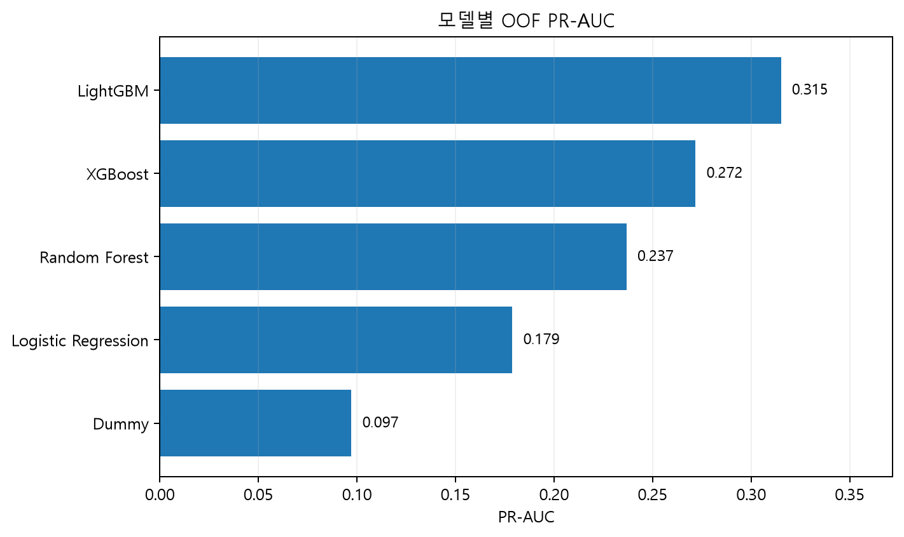
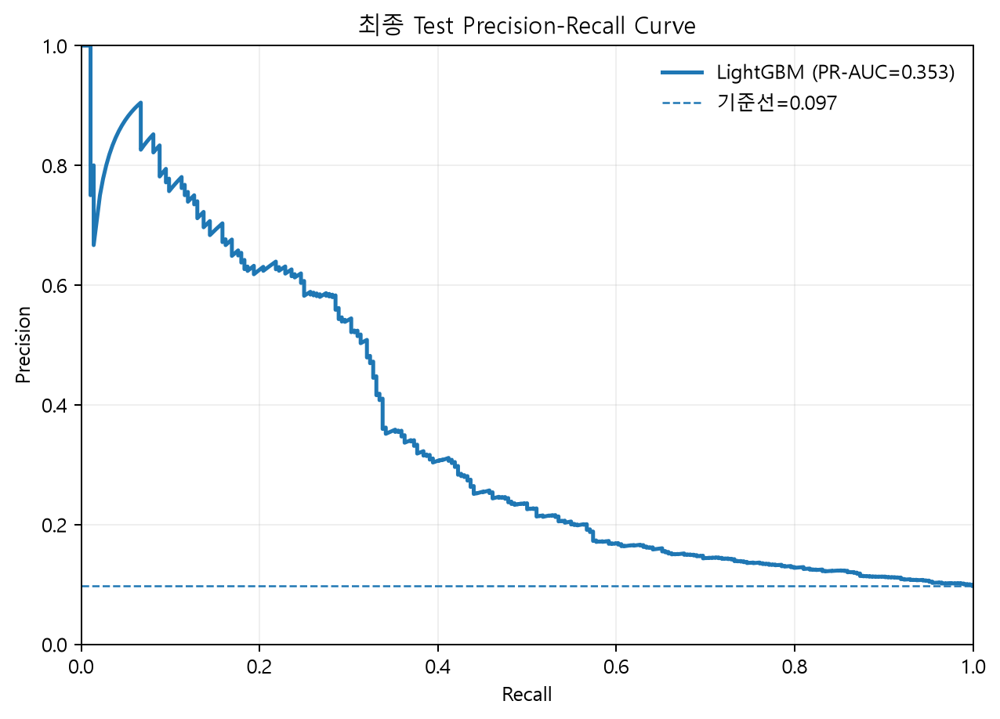
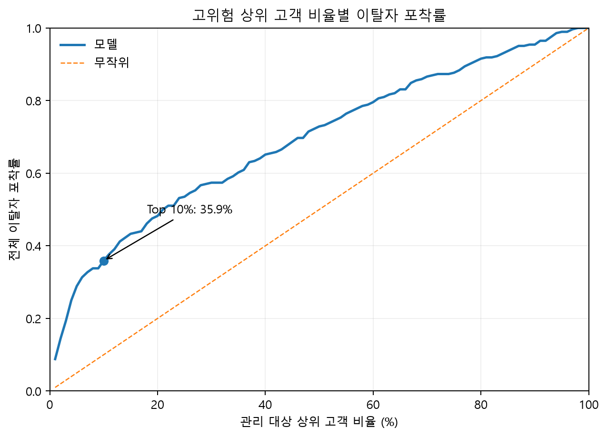
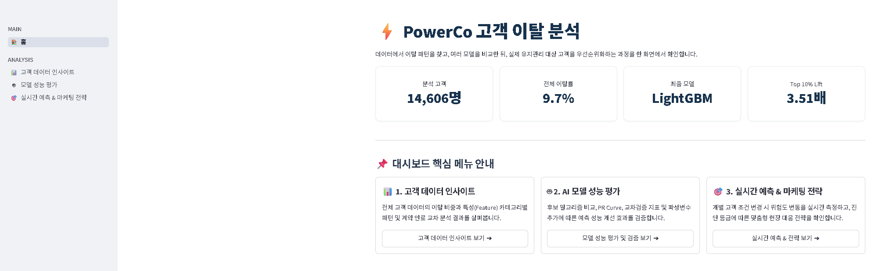
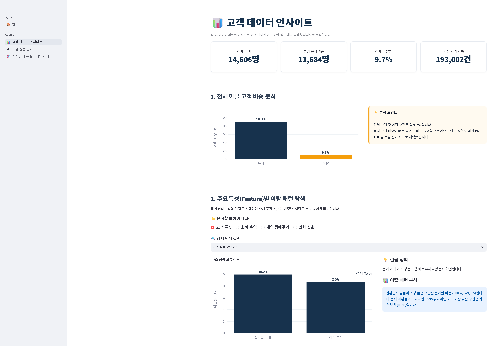
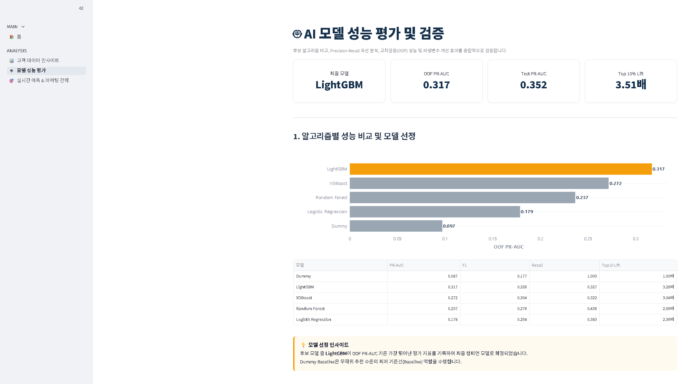
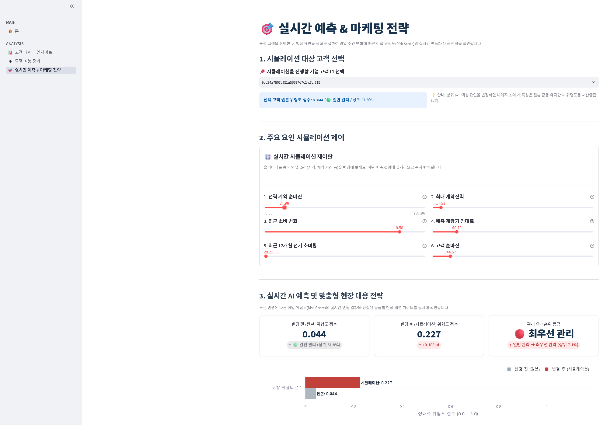

# ⚡ PowerCo 고객 이탈 예측 및 고위험 고객 선별

> **SKN (SK Networks) Family AI 캠프 2차 프로젝트**
>
> PowerCo SME 고객사 정보와 월별 가격 이력을 결합해 고객사별 이탈 위험도를 산출하고, 제한된 유지관리 자원으로 우선 대응할 고객사를 선별하는 머신러닝 프로젝트입니다.

---

## 📅 1. 프로젝트 개요 (Overview)

- **팀명**: StayWatt
- **프로젝트 기간**: 2026. 7. 13. – 2026. 7. 22.
- **분석 대상**: PowerCo SME 고객사 정보 및 월별 가격 이력
- **예측 단위**: SME 고객사 1곳
- **예측 목표**: 원본 `churn` Target을 기반으로 고객사별 이탈 위험도 산출
- **운영 기준**: `2016-01-01`을 기준으로 이후 3개월의 계약 종료·갱신 관련 피처 활용
- **활용 방향**: 이탈 여부를 단정하기보다 고객사 관리 우선순위를 결정하는 위험도 모델

### 핵심 목표

- 고객사·가격 이종 테이블을 고객 ID 기준으로 결합하고 정합성을 검증
- 고객사 단위 Train/Test 분할을 통해 동일 고객사 정보의 데이터 누수 방지
- 계약 생애주기 정보를 포함한 피처 엔지니어링 수행
- 여러 분류 알고리즘을 동일한 평가 체계에서 비교
- 최종 Champion 모델 저장 및 Streamlit 기반 예측 대시보드 구현

---

## 👥 2. 팀원 소개 및 역할 분담 (Team Members)

| 이름 | 역할 | 담당 업무 |
| :---: | :---: | :--- |
| **김정재** | **팀장** | 프로젝트 총괄, 데이터 수집 및 구조 설계, EDA 및 전처리, 데이터 분리 및 전처리 Pipeline 작성 등 |
| **김영석** | 팀원 | Git&GitHub 운영, Streamlit 구현 |
| **김혜진** | 팀원 | 머신러닝 모델 학습 및 비교, 성능 평가 및 임계값 결정, 최종 모델 저장 및 추론 검증 |
| **신가을** | 팀원 | 머신러닝 모델 학습 및 비교, 성능 평가 및 임계값 결정, README.md 작성 |

---

## 🛠️ 3. 기술 스택 (Tech Stack)

| 영역 | 기술 |
| :--- | :--- |
| **Language** | Python 3.10 이상 |
| **Data Processing** | Pandas, NumPy |
| **Machine Learning** | Scikit-learn |
| **Model Persistence** | joblib |
| **Visualization** | Matplotlib, Plotly |
| **Web Application** | Streamlit |

> 라이브러리 버전은 특정 환경에 고정하지 않으며, 필요한 패키지는 `requirements.txt`에서 관리합니다.

---

## 🧭 4. 프로젝트 흐름 (Workflow)

| 구분 | 프로젝트 흐름 |
| :--- | :--- |
| **1. 문제 정의·탐색** | 문제 정의 및 목표 설정 → 데이터 이해 및 EDA |
| **2. 데이터 준비** | 데이터 전처리 및 고객사 단위 통합 → Feature Engineering 및 Feature Set 선정 |
| **3. 모델링·검증** | 모델 학습 및 OOF 기반 비교 → 최종 모델 선정 및 Test 평가 |
| **4. 비즈니스 적용** | 고위험 고객사 선별 및 리텐션 전략 수립 → Streamlit 기반 실무 활용 구현 |

---

## 📊 5. 데이터셋 및 피처 엔지니어링 (Data & Feature Engineering)

### 데이터 출처

| 항목 | 내용 |
| :--- | :--- |
| 데이터셋 | BCG × Forage PowerCo 가상 데이터 |
| 출처 URL | [Kaggle - PowerCo](https://www.kaggle.com/datasets/erolmasimov/powerco) |

### 데이터 구성

| 데이터 | 규모 | 설명 |
| :--- | ---: | :--- |
| `client_data.csv` | 14,606행 / 26개 컬럼 | 고객사별 계약·소비·수익성 정보 |
| `price_data.csv` | 193,002행 / 8개 컬럼 | 고객사별 월간 가격 이력 |
| Train | 11,684행 | 전체 고객사의 80% |
| Test | 2,922행 | 전체 고객사의 20% |

### 전처리 및 피처 설계 원칙

- 고객 ID를 먼저 Train/Test로 나눈 뒤 각 고객사의 모든 가격 이력을 동일한 데이터셋에 배치
- `stratify=churn`, `random_state=42`를 적용해 이탈 비율을 유지
- A0 기본 피처 25개에 계약 날짜 기반 A3 피처 12개를 추가해 총 37개 모델 입력 피처 구성
- 최종 데이터는 `id` 1개, 모델 입력 피처 37개, 타깃 `churn` 1개로 총 39개 컬럼
- 결측치 대체와 One-Hot Encoding은 교차 검증 누수를 방지하기 위해 모델 Pipeline 내부에서 수행
- StandardScaler는 Logistic Regression에만 적용하고 트리 기반 모델에는 적용하지 않음
- 클래스 가중치와 오버샘플링을 비교했으나 최종 LightGBM은 무가중치 설정을 채택

데이터 구성, 전처리 실행 과정, 파생 변수 정의 및 데이터 누수 방지 방식은 [데이터 전처리 보고서](데이터_전처리_보고서_4team.md)를 참고하세요.

---

## 📈 6. 모델 학습 및 평가 결과 (Results)

### 모델 선정 방법

- Dummy 기준 모델과 Logistic Regression, Random Forest, XGBoost, LightGBM 비교
- Outer 5-Fold, Inner 3-Fold Nested CV 적용
- Inner Fold에서 PR-AUC 기준 `RandomizedSearchCV` 수행
- Train OOF 예측으로 모델을 비교하고 F1 기준 분류 임계값 결정
- 모델과 임계값을 확정한 후 Test 데이터에 고정 적용

### 후보 모델 OOF 성능

<table>
  <tr>
    <td width="52%" valign="top">
      <table>
        <thead>
          <tr>
            <th align="left">모델</th>
            <th align="right">OOF PR-AUC</th>
            <th align="right">F1</th>
            <th align="right">Top 10% Lift</th>
          </tr>
        </thead>
        <tbody>
          <tr><td><strong>LightGBM</strong></td><td align="right"><strong>0.3172</strong></td><td align="right"><strong>0.3263</strong></td><td align="right"><strong>3.2847</strong></td></tr>
          <tr><td>XGBoost</td><td align="right">0.2717</td><td align="right">0.3038</td><td align="right">3.0381</td></tr>
          <tr><td>Random Forest</td><td align="right">0.2367</td><td align="right">0.2761</td><td align="right">2.5626</td></tr>
          <tr><td>Logistic Regression</td><td align="right">0.1788</td><td align="right">0.2590</td><td align="right">2.3600</td></tr>
          <tr><td>Dummy</td><td align="right">0.0971</td><td align="right">0.1771</td><td align="right">1.0000</td></tr>
        </tbody>
      </table>
    </td>
    <td width="48%" valign="top">
      
    </td>
  </tr>
</table>

최종 Champion은 OOF PR-AUC와 Top 10% Lift가 가장 높은 **LightGBM**입니다.

> OOF PR-AUC는 이탈 고객사 비중이 낮은 불균형 데이터에서 각 모델이 실제 이탈 고객사를 얼마나 효과적으로 상위 위험군에 배치하는지 비교하는 핵심 지표입니다.

### Champion Test 성능

<table>
  <tr>
    <td width="40%" valign="top">
      <table>
        <thead>
          <tr><th align="left">지표</th><th align="right">결과</th></tr>
        </thead>
        <tbody>
          <tr><td>PR-AUC</td><td align="right"><strong>0.3516</strong></td></tr>
          <tr><td>ROC-AUC</td><td align="right">0.7110</td></tr>
          <tr><td>Precision</td><td align="right">0.2672</td></tr>
          <tr><td>Recall</td><td align="right">0.4507</td></tr>
          <tr><td>F1</td><td align="right">0.3355</td></tr>
          <tr><td>Top 10% Recall</td><td align="right"><strong>0.3521</strong></td></tr>
          <tr><td>Top 10% Lift</td><td align="right"><strong>3.5115</strong></td></tr>
          <tr><td>OOF 기준 분류 임계값</td><td align="right">0.1305</td></tr>
        </tbody>
      </table>
    </td>
    <td width="60%" valign="top">
      
    </td>
  </tr>
</table>

> 최종 Test PR-AUC는 0.3516으로 이탈률 기준선 약 0.097보다 높게 나타났습니다. 이는 LightGBM이 미사용 Test 데이터에서도 실제 이탈 고객사를 상위 위험군에 배치하는 순위화 성능을 유지했음을 보여줍니다.

Test 고객사 중 예측 위험도 상위 10%를 우선 관리하면 전체 이탈 고객사의 약 35.2%를 포함하며, 무작위 선정 대비 약 3.51배 높은 이탈 고객사 밀도를 확보할 수 있습니다.

> 모델 출력은 고객사 간 우선순위를 위한 예측 위험도 점수입니다. 별도의 확률 보정을 수행하지 않았으므로 실제 이탈 확률로 단정하지 않습니다.

전체 실험 설계, 후보 모델 비교, Champion 선정 및 Test 평가는 [인공지능 모델 학습 보고서](인공지능_모델_학습_보고서_4team.md)를 참고하세요.

---

## 🎯 7. 비즈니스 활용 (Business Application)

모델은 “누가 반드시 이탈하는가?”를 확정하기보다 다음 질문에 답하는 것을 목표로 합니다.

> 제한된 유지관리 인력과 예산으로 어느 고객사에 먼저 연락해야 하는가?

### 고객사 우선순위별 B2B 실행 전략

| 운영 구간 | 구간 인원 및 Test 누적 성과 | 권장 채널·시점 | 세부 실행 방법 |
| :--- | :--- | :--- | :--- |
| **Top 5% 집중 대응군** | 구간 147개사<br>Top 5% 누적: 이탈 고객사 81개사, Recall 28.5%, Lift 5.67 | B2B 전담 영업 담당자(AM)의 1:1 유선·방문 상담<br>계약 만료 D-90 Pilot | <ol><li>계약·갱신 일정과 이탈 위험 신호 확인</li><li>고객사 가치·마진을 반영해 혜택 범위 결정</li><li>맞춤형 요금제와 에너지 효율 상담을 제공하고, 고객사 가치에 따라 계약 갱신 특별 단가를 제안한 뒤 반응 기록</li></ol> |
| **Top 5–10% CRM 대응군** | 추가 146개사<br>Top 10% 누적: 293개사 중 이탈 고객사 100개사, Recall 35.2%, Lift 3.51 | B2B 이메일·CRM 자동화 채널<br>계약 만료 D-60 Pilot | <ol><li>계약 갱신 안내와 재계약 단가 혜택 및 요금 옵션 제안 발송</li><li>열람·상담 신청·불만 등 고객사 반응 수집</li><li>반응 고객사를 1:1 상담으로 연결하고 기한부 제안의 Pilot 효과 검증</li></ol> |
| **Top 10–20% 디지털 관리군** | 추가 292개사<br>Top 20% 누적: 585개사 중 이탈 고객사 141개사, Recall 49.6%, Lift 2.48 | 디지털 채널(앱 푸시·이메일 뉴스레터)<br>계약 만료 D-30 Pilot | <ol><li>계약 만료·유지 혜택·에너지 절감 정보 안내</li><li>만족도와 가격·서비스 관련 신규 신호 수집</li><li>부정적 반응 고객사는 상위 대응 단계로 재분류</li></ol> |

Top 20% 밖의 고객사는 고비용 캠페인보다 정기적인 위험도 재산출과 신규 위험 신호 모니터링을 우선합니다.

> 표의 Recall과 Lift는 각 개별 구간만의 성과가 아니라 **Top 5%, Top 10%, Top 20%까지 포함한 누적 Test 성과**입니다. D-90·D-60·D-30 접촉 시점과 단가 할인·재계약 조건은 모델이 검증한 최적값이 아닌 Pilot 가정이므로 A/B Test를 통해 효과와 비용을 확인해야 합니다.



> 관리 범위를 넓힐수록 더 많은 실제 이탈 고객사를 포함하지만 고객사당 선별 효율은 낮아질 수 있습니다. 따라서 상담 인력과 예산에 맞춰 Top-K 범위를 결정합니다.

### Streamlit 연계

- **모델 성능 평가:** 후보 알고리즘, PR Curve, OOF·Test 지표, Top-K 포착 효율, Feature Engineering 개선 효과와 Feature Importance를 확인합니다.
- **실시간 예측 & 마케팅 전략:** 개별 고객사의 주요 예측 신호를 조절해 변경 전·후 위험도 점수와 기준 고객사군 대비 `top_percent`를 비교하고, Top 5%·5–10%·10–20%별 Pilot 대응 카드를 확인합니다.

Streamlit의 What-If 결과는 입력값 변화에 따른 모델 점수의 민감도이며, 해당 조건을 실제로 변경했을 때 이탈이 감소한다는 인과적 효과를 의미하지 않습니다. 화면의 D-90·D-60·D-30 접촉 시점과 단가 할인·재계약 조건도 운영 가안이므로 소규모 Pilot과 A/B Test로 효과를 확인해야 합니다. ROI와 캠페인 효과 역시 실제 운영 성과가 아니므로 고객사 가치·캠페인 비용·방어 성공률을 별도로 검증해야 합니다. 자세한 실행 기준과 ROI 가정은 [비즈니스 활용 및 이탈 방어 전략](docs/business_application.md)을 참고하세요.

---

## 💻 8. 환경 설정 및 사용 방법 (Getting Started)

### 사전 요구사항

- Git
- Python 3.10 이상
- 터미널에서 `git --version`과 `python --version` 명령을 실행할 수 있는 환경

### 1. 저장소 복제 및 이동

```bash
git clone https://github.com/golddragon0926/SKN33_2_4team_project.git
cd SKN33_2_4team_project
```

> 이미 저장소를 복제한 경우에는 프로젝트 루트로 이동한 뒤 2단계부터 진행합니다.

### 2. 가상환경 생성

프로젝트 루트에서 가상환경을 생성합니다.

```bash
python -m venv .venv
```

Windows PowerShell:

```powershell
.venv\Scripts\Activate.ps1
```

macOS 또는 Linux:

```bash
source .venv/bin/activate
```

### 3. 의존성 설치

```bash
python -m pip install --upgrade pip
python -m pip install -r requirements.txt
```

### 4. 대시보드 바로 실행

저장소에 포함된 전처리 데이터, 모델 및 평가 산출물을 그대로 사용하는 경우 다음 명령만 실행하면 됩니다.

```bash
python -m streamlit run streamlit_app/app.py
```

> 저장된 모델이 현재 라이브러리 환경에서 로드되지 않는 경우 아래 전체 모델 학습 명령을 실행해 모델과 평가 산출물을 다시 생성하세요.

### 5. 전체 파이프라인 재실행

#### 데이터 전처리

```bash
python preprocessing/data_preprocessing.py
python preprocessing/preprocessing_plus.py
```

전처리 결과는 `data/interim/`, `data/processed/`, `artifacts/eda/`에 저장됩니다.

#### 전체 모델 학습 및 평가

```bash
python modeling/run_all_models.py
```

위 명령은 Dummy 기준 모델과 4개 후보 모델을 순차 학습한 뒤 통합 평가를 수행합니다. Nested CV와 하이퍼파라미터 탐색을 포함하므로 실행 환경에 따라 시간이 오래 걸릴 수 있습니다.

주요 결과는 다음 위치에 저장됩니다.

- 학습 모델: `models/`
- OOF 예측: `artifacts/oof_predictions/`
- 튜닝 결과: `artifacts/tuning/`
- 평가 결과: `artifacts/`

#### 대시보드 실행

```bash
python -m streamlit run streamlit_app/app.py
```

---

## 🖥️ 9. 대시보드 구성 (Dashboard)

| 화면 | 주요 기능 |
| :--- | :--- |
| **🏠 홈** | 프로젝트 소개와 핵심 메뉴 안내 |
| **📊 고객 데이터 인사이트** | 이탈 비중, 주요 특성별 패턴, 계약 기간·만료 시점 및 단기 가격 변동 분석 |
| **🤖 모델 성능 평가** | 후보 알고리즘 비교, PR Curve, OOF·Test 성능, Top-K 포착 효율, Feature Engineering 개선 효과 및 Feature Importance |
| **🎯 실시간 예측 & 마케팅 전략** | 개별 고객사 What-If 시뮬레이션, 상대적 위험 순위 확인 및 Top 5%·5–10%·10–20%별 Pilot 대응 전략 안내 |

### Streamlit 실행 화면

<table>
  <tr>
    <td width="50%" align="center">
      <strong>홈</strong><br>
      
    </td>
    <td width="50%" align="center">
      <strong>고객 데이터 인사이트</strong><br>
      
    </td>
  </tr>
  <tr>
    <td width="50%" align="center">
      <strong>AI 모델 성능 평가 및 검증</strong><br>
      
    </td>
    <td width="50%" align="center">
      <strong>실시간 예측 및 마케팅 전략</strong><br>
      
    </td>
  </tr>
</table>

---

## 📂 10. 디렉토리 구조 (Directory Structure)

```text
project/
├── README.md
├── CONTRIBUTING.md             # Git·GitHub 협업 규칙
├── requirements.txt
├── 데이터_전처리_보고서_4team.md      # 공식 전처리 제출 보고서
├── 인공지능_모델_학습_보고서_4team.md  # 공식 모델 학습 제출 보고서
├── data/
│   ├── raw/                     # 원본 고객·가격 데이터
│   ├── interim/                 # 단계별 중간 데이터
│   └── processed/               # 최종 Train/Test 데이터
├── preprocessing/
│   ├── eda.ipynb
│   ├── data_preprocessing.py
│   └── preprocessing_plus.py
├── modeling/
│   ├── modeling_utils.py        # 공통 전처리·학습 함수
│   ├── train_*.py               # 모델별 학습 스크립트
│   ├── run_all_models.py        # 전체 모델 학습·평가 실행
│   └── evaluate.py              # Champion 선정 및 Test 평가
├── models/
│   ├── *_pipeline.joblib
│   ├── champion_bundle.joblib
│   └── champion_metadata.json
├── src/
│   └── predict.py               # 공용 추론 및 설명 로직
├── artifacts/
│   ├── eda/
│   ├── experiments/
│   ├── oof_predictions/
│   └── tuning/
├── docs/
│   ├── data_and_feature_engineering.md
│   ├── results.md
│   ├── business_application.md
│   └── images/
│       ├── preprocessing_report/
│       ├── modeling_report/
│       └── streamlit/
└── streamlit_app/
    ├── app.py
    ├── common/                  # 경로·데이터 로딩·공통 UI 모듈
    │   ├── __init__.py
    │   ├── config.py
    │   ├── data_loader.py
    │   └── ui_styles.py
    └── pages/
        ├── 1_Dashboard.py              # 고객 데이터 인사이트
        ├── 2_Model_Performance.py      # AI 모델 성능 평가 및 검증
        └── 3_Realtime_Prediction.py    # 실시간 예측 및 마케팅 전략
```

---

## 📚 11. 공식 제출 보고서 (Official Reports)

- [데이터 전처리 보고서](데이터_전처리_보고서_4team.md)
- [인공지능 모델 학습 보고서](인공지능_모델_학습_보고서_4team.md)

---

## ⚠️ 12. 한계 및 향후 과제 (Limitations)

1. **데이터 범위 제한**: 활용 가능한 데이터가 계약·소비·가격 정보 중심이므로 고객 만족도와 경쟁사 정보 등 이탈 요인을 충분히 반영하지 못했습니다. 향후 고객 행동 및 외부 데이터를 추가해 피처 범위를 확장할 필요가 있습니다.
2. **이탈 고객사 포착 한계**: 최종 Recall은 45.1%로 실제 이탈 고객사의 절반 이상을 포착하지 못했습니다. 추가 피처 확보와 모델 개선을 진행하고, 캠페인 비용과 관리 가능 고객사 수를 함께 고려해 운영 기준을 최적화해야 합니다.
3. **캠페인 효과 미검증**: 고위험 고객사의 우선순위는 제시했지만 실제 캠페인이 이탈 감소로 이어지는지는 검증하지 못했습니다. 실제 캠페인 결과와 연계한 A/B Test 또는 Uplift Modeling으로 개입 효과를 검증해야 합니다.

---

## 🛠️ Git & GitHub 협업 규칙 (Convention)

브랜치 전략, 커밋 메시지 및 Pull Request 규칙은 [CONTRIBUTING.md](CONTRIBUTING.md)를 참고하세요.
