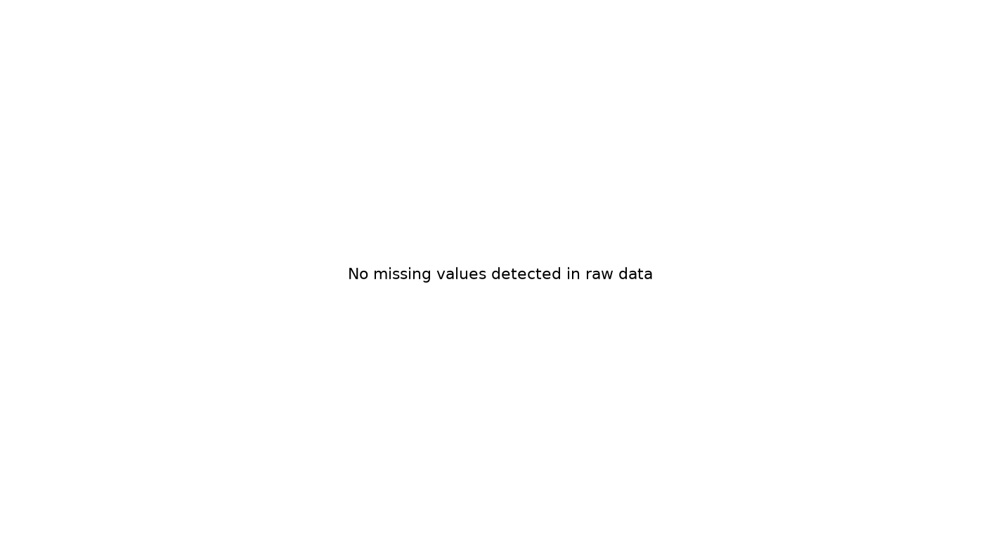

# PowerCo 데이터 전처리 보고서

## 1. 보고서 개요

### 1.1 목적

본 보고서는 PowerCo 고객 이탈 예측 프로젝트에서 사용한 데이터 전처리 과정을 정리한 문서이다.  
원본 데이터의 구조와 문제점을 먼저 확인하고, **결측치 처리 → 중복 및 이상값 점검 → 고객 단위 데이터 통합 → Feature Engineering → 범주형 인코딩 → 모델별 Scaling** 순서로 어떤 처리를 수행했는지 설명한다.

최종 목표는 다음과 같다.

> 고객의 계약·소비·가격 정보를 고객 1명당 1행의 모델링 데이터로 구성하고, 학습 데이터의 정보가 검증 데이터에 유출되지 않도록 전처리 Pipeline을 설계한다.

### 1.2 분석 기준

| 항목 | 기준 |
|---|---|
| 분석 단위 | 고객 1명 |
| 기준일 | `2016-01-01` |
| 예측 구간 | `2016-01-01` 이상 ~ `2016-04-01` 미만 |
| 타깃 | `churn` (`0`: 유지, `1`: 이탈) |
| Train/Test 분할 | 80:20 Stratified Split |
| Random State | `42` |
| 최종 Feature | 37개 |
| 최종 범주형 Feature | `channel_sales`, `has_gas`, `origin_up` |

---

## 2. 원본 데이터 구조

프로젝트에서는 두 개의 원본 데이터를 사용했다.

### 2.1 `client_data.csv`

고객 1명당 1행으로 구성된 고객 단위 데이터이다.

- 크기: **14,606행 × 26열**
- 주요 정보
  - 계약 시작일·종료일·상품 변경일·갱신일
  - 전기·가스 소비량
  - 향후 소비량 및 가격 예측값
  - 순마진과 계약전력
  - 판매 채널·계약 유입 경로
  - 활성 상품 수와 고객 유지 연차
  - 이탈 여부 `churn`

### 2.2 `price_data.csv`

고객별 월별 가격 이력 데이터이다.

- 크기: **193,002행 × 8열**
- 한 고객이 여러 월의 가격 행을 가짐
- 주요 정보
  - 비첨두·첨두·중간 시간대 에너지 가격
  - 비첨두·첨두·중간 시간대 전력 가격

두 데이터의 분석 단위가 다르기 때문에 그대로 병합할 수 없다.

```text
client_data.csv
고객 1명 = 1행

price_data.csv
고객 1명 = 여러 월의 가격 행
```

따라서 가격 데이터를 먼저 **고객 단위 Feature로 집계한 후** 고객 데이터와 병합했다.

---

## 3. 원본 데이터 상태 확인

### 3.1 타깃 불균형

전체 고객 중 이탈 고객은 약 **9.7%**로, 유지 고객이 훨씬 많은 불균형 데이터이다.


따라서 이후 모델 평가는 Accuracy만으로 판단하지 않고 **PR-AUC를 주요 지표**로 사용하며 Precision, Recall, F1, Top-K Recall/Lift를 함께 확인한다.

### 3.2 결측치

원본 데이터에는 일부 수치형·범주형·날짜형 변수에 결측이 존재할 수 있다.



결측치를 확인한 뒤 모든 결측을 CSV 단계에서 일괄 대체하지 않았다.  
이는 모델 학습 전에 전체 데이터의 중앙값이나 범주 정보를 사용하면 Validation 데이터 정보가 Train 전처리에 섞일 수 있기 때문이다.

따라서 전처리는 두 단계로 분리했다.

```text
CSV 생성 단계
→ 결측을 NaN 상태로 유지
→ 잘못된 값과 무한대만 NaN으로 통일

모델 Pipeline 단계
→ Train Fold에서만 결측 대체 규칙 학습
→ Validation/Test에는 학습된 규칙만 적용
```

---

## 4. 전체 전처리 흐름

```text
client_data.csv + price_data.csv
        ↓
1. 원본 스키마 및 키 검증
        ↓
2. 날짜형 변환
        ↓
3. 고객 ID 기준 Train/Test 분할
        ↓
4. 가격 이력도 고객 ID 기준으로 분리
        ↓
5. 기준일 이전 가격 이력만 사용
        ↓
6. 월별 가격 → 고객 단위 Feature 집계
        ↓
7. 고객 데이터 + 가격 Feature 병합
        ↓
8. A0 기본 Feature Engineering
        ↓
9. 중복·무한대·불필요 컬럼 정리
        ↓
10. A3 계약 생애주기 Feature 12개 추가
        ↓
11. 최종 37개 Feature 확정
        ↓
12. 모델 Pipeline
    - 수치형 결측 대체
    - Missing Indicator
    - 범주형 결측 대체
    - One-Hot Encoding
    - Logistic Regression Scaling
```

---

# 5. 1단계: 데이터 구조 및 기본키 검증

## 5.1 원래 상태

두 데이터는 서로 다른 기본키 구조를 가진다.

| 데이터 | 기본키 |
|---|---|
| `client_data.csv` | `id` |
| `price_data.csv` | `id + price_date` |

`client_data`에서 고객 ID가 중복되면 고객 단위 모델링이 불가능하고, `price_data`에서 같은 고객·같은 월의 가격 행이 중복되면 가격 집계 결과가 왜곡될 수 있다.

## 5.2 처리 방법

다음 항목을 코드에서 검증했다.

- `client_data`의 전체 행 중복
- `client_data`의 `id` 중복
- `price_data`의 전체 행 중복
- `price_data`의 `id + price_date` 중복
- 고객 데이터와 가격 데이터의 고객 집합 일치 여부
- 가격 이력이 없는 고객 존재 여부

기본키 중복이 존재하는 경우 조용히 제거하지 않고 **오류를 발생시켜 원본 문제를 먼저 확인하도록 설계**했다.

---

# 6. 2단계: 날짜형 변환

## 6.1 원래 상태

다음 날짜 컬럼은 CSV에서 문자열 형태로 읽힌다.

- `date_activ`
- `date_end`
- `date_modif_prod`
- `date_renewal`
- `price_date`

문자열 상태에서는 기간 계산이나 기준일 비교를 안정적으로 수행하기 어렵다.

## 6.2 처리 방법

`pd.to_datetime(..., errors="coerce")`를 사용하여 날짜형으로 변환했다.

잘못된 날짜 값은 임의의 날짜로 대체하지 않고 `NaT`로 처리했다.

```text
잘못된 날짜 문자열
→ NaT
→ 이후 날짜 Feature도 결측 유지
→ 모델 Pipeline에서 결측 정보 처리
```

원본 날짜 컬럼 자체는 최종 모델에 직접 넣지 않고, 기준일을 중심으로 의미 있는 기간·여부 Feature로 변환했다.

---

# 7. 3단계: Train/Test 분할

## 7.1 필요한 이유

`price_data`는 한 고객이 여러 행을 가진다.

가격 행을 먼저 랜덤 분할하면 같은 고객의 일부 월은 Train, 다른 월은 Test에 들어갈 수 있어 **고객 정보 유출**이 발생한다.

## 7.2 처리 방법

먼저 `client_data`에서 고객 ID를 기준으로 Train/Test를 나눴다.

```text
client_data
        ↓
고객 ID 기준 80:20 Stratified Split
        ↓
Train 고객 ID / Test 고객 ID 확정
        ↓
각 고객의 모든 가격 이력을 같은 Split으로 배정
```

최종 고객 수:

| 구분 | 고객 수 |
|---|---:|
| Train | 11,684 |
| Test | 2,922 |

`churn` 비율을 유지하기 위해 Stratified Split을 사용했다.


이 과정으로 다음을 보장한다.

- 동일 고객의 Train/Test 중복 없음
- 한 고객의 월별 가격 이력이 서로 다른 Split에 섞이지 않음
- Train/Test의 이탈 비율이 원본과 유사하게 유지됨

---

# 8. 4단계: 결측치 처리

결측치는 **CSV 단계와 모델 Pipeline 단계의 역할을 분리**했다.

## 8.1 수치형 결측치

### 원래 상태

소비량, 마진, 가격 변화율, 계약 기간 파생변수 등에 `NaN`이 존재할 수 있다.

특히 비율 Feature는 분모가 0이거나 기준값이 없는 경우 결측이 발생할 수 있다.

### 처리

CSV 생성 단계에서는 수치 결측치를 임의로 채우지 않는다.

```text
원본 NaN
분모 0
±inf
날짜 정보 부족으로 계산 불가
        ↓
NaN으로 통일
```

모델 학습 시에는 Pipeline 내부에서:

```text
SimpleImputer(strategy="median", add_indicator=True)
```

를 사용한다.

즉,

1. Train Fold의 중앙값으로 결측치를 대체
2. 원래 결측이었는지를 나타내는 Missing Indicator 추가
3. Validation/Test에는 Train에서 학습한 중앙값만 적용

이렇게 처리해 데이터 누수를 방지했다.

---

## 8.2 범주형 결측치

최종 범주형 Feature는 다음 3개다.

- `channel_sales`
- `has_gas`
- `origin_up`

### 원래 상태

빈 문자열 또는 실제 결측이 존재할 수 있다.

### 처리

먼저 공백 문자열을 `NaN`으로 통일하고, 모델 Pipeline에서:

```text
NaN
→ "MISSING"
→ One-Hot Encoding
```

으로 처리한다.

결측을 단순 제거하지 않고 하나의 정보로 유지하는 이유는 **정보가 누락된 고객군 자체가 특정 패턴을 가질 가능성**이 있기 때문이다.

---

# 9. 5단계: 중복 및 불필요 정보 처리

## 9.1 행 중복

고객 ID 및 가격 기본키 중복을 검증하고, 최종 데이터에서도 다음을 다시 확인한다.

- Train 전체 행 중복
- Test 전체 행 중복
- Train ID 중복
- Test ID 중복
- Train/Test ID 교집합

검증 실패 시 데이터 생성 과정을 중단하도록 했다.

## 9.2 중복 Feature

Train 데이터를 기준으로 **값과 결측 위치가 완전히 동일한 컬럼**을 탐지한다.

동일한 정보를 가진 Feature를 동시에 사용하면 모델 복잡도만 증가시키고 해석을 어렵게 할 수 있으므로 정확한 중복 컬럼은 제거한다.

또한:

- `margin_gross_pow_ele`
- `margin_net_pow_ele`

두 컬럼이 99.9% 이상 동일한 경우 하나를 중복 정보로 판단해 제거하도록 했다.

---

# 10. 6단계: 이상값과 무한대 처리

## 10.1 이상값

소비량, 계약전력, 마진 등의 수치 변수는 매우 큰 값을 가질 수 있다.

그러나 에너지 고객 데이터에서는 큰 값이 단순 오류가 아니라 **실제 대형 고객의 특성**일 수 있다.

따라서 IQR 기준으로 고객 행을 일괄 제거하지 않았다.

```text
큰 값
≠ 자동 이상값 삭제
```

명백한 오류 근거가 없는 한 원본 고객 모집단을 유지했다.

## 10.2 무한대

가격 변화율 또는 비율 Feature에서 분모가 0이면 무한대가 발생할 수 있다.

이를 방지하기 위해 `safe_ratio()`를 사용했다.

```text
분모 = 0
→ NaN

계산 결과 = +inf / -inf
→ NaN
```

최종 Train/Test에서 무한대 셀이 0개인지 검증한다.

---

# 11. 7단계: 가격 데이터 고객 단위 집계

## 11.1 원래 상태

`price_data.csv`는 월별 데이터이므로 고객 한 명이 여러 행을 가진다.

이를 그대로 고객 데이터와 병합하면 한 고객이 여러 행으로 복제된다.

## 11.2 기준일 통제

예측 기준일은 `2016-01-01`이다.

따라서 기준일 이후의 가격 정보는 사용하지 않는다.

```text
price_date < 2016-01-01
```

조건만 사용해 미래 정보 유입을 방지했다.

월별 가격 변화도 함께 확인했다.


## 11.3 집계 방식

비첨두 시간대의 에너지 가격과 전력 가격에 대해:

- 최근 3개월 평균
- 그 이전 기간 평균
- 기준일 이전 마지막 가격

을 계산했다.

이후 최근 가격 변화율을 생성했다.

```text
최근 3개월 평균 - 이전 기간 평균
--------------------------------
         이전 기간 평균의 절댓값
```

최종적으로 월별 여러 행을 고객 1명당 1행의 가격 Feature로 축약했다.

---

# 12. 8단계: A0 기본 Feature Engineering

기본 고객 데이터와 집계된 가격 정보를 결합해 A0 기준선을 생성했다.

## 12.1 생성한 파생 Feature 6개

| Feature | 설명 |
|---|---|
| `contract_end_within_3m` | 향후 3개월 안에 계약 종료 예정인지 |
| `recent_consumption_change_log` | 최근 1개월 소비와 12개월 월평균 소비의 로그 차이 |
| `off_peak_energy_recent_change_rate` | 최근 비첨두 에너지 가격 변화율 |
| `off_peak_power_recent_change_rate` | 최근 비첨두 전력 가격 변화율 |
| `forecast_off_peak_energy_change` | 최근 실제 에너지 가격 대비 예측 가격 변화 |
| `forecast_off_peak_power_change` | 최근 실제 전력 가격 대비 예측 가격 변화 |

A0 기준 모델 Feature는 **25개**다.


---

# 13. 9단계: A3 계약 생애주기 Feature Engineering

A0에서는 계약 날짜 정보가 충분히 활용되지 않았다.

고객이 **계약 생애주기의 어느 위치에 있는지** 표현하기 위해 계약 날짜 기반 Feature 12개를 추가했다.

| Feature | 설명 |
|---|---|
| `contract_tenure_days` | 기준일까지 계약 유지 일수 |
| `total_contract_days` | 전체 예정 계약 기간 |
| `days_until_contract_end` | 기준일부터 계약 종료일까지 남은 일수 |
| `days_until_renewal` | 기준일부터 갱신일까지 남은 일수 |
| `days_since_product_modification` | 상품 변경 후 기준일까지 경과 일수 |
| `renewal_end_gap_days` | 갱신일과 계약 종료일의 간격 |
| `modified_within_3m` | 최근 3개월 내 상품 변경 여부 |
| `renewal_within_3m` | 향후 3개월 내 갱신 예정 여부 |
| `contract_age_ratio` | 전체 계약 기간 중 현재까지 경과 비율 |
| `contract_end_before_reference` | 계약 종료일이 기준일 이전인지 |
| `renewal_before_reference` | 갱신일이 기준일 이전인지 |
| `modification_after_reference` | 상품 변경일이 기준일 이후인지 |

Feature Engineering 전후:

```text
A0: 25개 Feature
        ↓
계약 생애주기 Feature 12개 추가
        ↓
A3: 37개 Feature
```


---

## 13.1 계약 유지 기간과 이탈률

계약 유지 기간별 이탈률을 확인해 계약 생애주기 정보가 고객 행동을 구분하는 데 의미가 있는지 살펴봤다.


이 결과는 인과관계가 아니라 **Feature Engineering의 필요성을 확인하기 위한 탐색적 패턴**으로 해석한다.

## 13.2 계약 종료까지 남은 기간과 이탈률


계약 종료 시점까지 남은 기간을 단순 날짜가 아닌 수치 Feature로 변환함으로써, 모델이 고객의 계약 시점을 비교 가능한 형태로 사용할 수 있게 했다.

## 13.3 최근 소비 변화와 이탈률


최근 소비 변화는 원래의 절대 소비량만으로는 포착하기 어려운 **고객 행동의 변화 방향**을 나타내기 위해 생성했다.

---

# 14. 10단계: 최종 데이터 구성

최종 데이터는 다음 구조로 저장된다.

```text
data/
├── interim/
│   ├── 01_train_client.csv
│   ├── 01_test_client.csv
│   ├── 01_train_price.csv
│   ├── 01_test_price.csv
│   ├── 02_train_merged.csv
│   ├── 02_test_merged.csv
│   ├── 03_train_plus.csv
│   └── 03_test_plus.csv
│
└── processed/
    ├── train.csv
    └── test.csv
```

각 단계의 의미:

| 단계 | 의미 |
|---|---|
| `01_*` | 고객 단위 Train/Test 분할 결과 |
| `02_*_merged.csv` | 고객 + 가격 집계 + A0 Feature 결과 |
| `03_*_plus.csv` | A3 계약 Feature까지 추가한 최종 중간 산출물 |
| `processed/train.csv`, `test.csv` | 모델이 공식적으로 읽는 최종 입력 데이터 |

`03_train_plus.csv`와 `processed/train.csv`는 같은 최종 A3 DataFrame을 저장한다.

차이는 목적이다.

```text
03_train_plus.csv
→ 처리 이력 및 중간 산출물 보존

processed/train.csv
→ 모델링 코드가 사용하는 공식 최종 입력
```

최종 데이터:

| 항목 | Train | Test |
|---|---:|---:|
| 고객 수 | 11,684 | 2,922 |
| 모델 Feature | 37 | 37 |
| ID | 1개 | 1개 |
| Target | 1개 | 1개 |
| 전체 컬럼 | 39 | 39 |

---

# 15. 11단계: 모델 Pipeline에서의 최종 전처리

`processed/train.csv`와 `test.csv`는 모델 입력용 최종 Feature 구조를 가진 데이터지만, **결측 대체·인코딩·Scaling은 아직 전체 데이터에 미리 적용하지 않는다.**

이 처리는 모델 Pipeline 내부에서 수행한다.

## 15.1 수치형

범주형 3개를 제외한 Feature를 수치형으로 처리한다.

```text
수치형 Feature
        ↓
Median Imputation
        ↓
Missing Indicator 추가
        ↓
Logistic Regression인 경우만 StandardScaler
```

코드 기준:

```python
SimpleImputer(
    strategy="median",
    add_indicator=True
)
```

### 왜 중앙값을 사용했는가?

소비량·마진·계약전력과 같은 변수는 분포가 비대칭일 수 있고 큰 값의 영향을 받을 수 있다.

평균보다 중앙값이 극단값의 영향을 덜 받기 때문에 수치형 결측 대체에 사용했다.

---

## 15.2 범주형

최종 범주형 Feature:

```text
channel_sales
has_gas
origin_up
```

처리 순서:

```text
NaN
        ↓
"MISSING" 범주로 대체
        ↓
One-Hot Encoding
```

코드 기준:

```python
SimpleImputer(
    strategy="constant",
    fill_value="MISSING"
)

OneHotEncoder(
    handle_unknown="ignore"
)
```

`handle_unknown="ignore"`를 사용해 Train에 없던 범주가 Validation/Test에 등장하더라도 예측 과정이 중단되지 않도록 했다.

---

## 15.3 Scaling

Scaling은 모든 모델에 동일하게 적용하지 않았다.

| 모델 | Scaling |
|---|---|
| Logistic Regression | `StandardScaler` 적용 |
| Random Forest | 미적용 |
| XGBoost | 미적용 |
| LightGBM | 미적용 |

Logistic Regression은 Feature 크기에 영향을 받기 때문에 표준화를 적용했다.

반면 Tree 기반 모델은 분할 기준으로 학습하므로 Feature 단위 차이에 상대적으로 영향을 덜 받아 별도 Scaling을 적용하지 않았다.

---

# 16. 전처리 Pipeline을 모델 내부에 둔 이유

가장 중요한 원칙은 **데이터 누수 방지**다.

잘못된 방식:

```text
전체 Train 데이터의 중앙값 계산
        ↓
전체 Train에 결측 대체
        ↓
Cross Validation
```

이 경우 Validation Fold의 정보가 중앙값 계산에 이미 사용된다.

본 프로젝트에서는:

```text
Cross Validation 분할
        ↓
각 Train Fold에서만
- 중앙값 학습
- 범주형 대체 규칙 적용
- One-Hot Encoder 학습
- Scaling 학습
        ↓
해당 Validation Fold에 변환만 적용
```

하도록 `Pipeline`과 `ColumnTransformer`를 사용했다.

이를 통해 전처리 과정까지 Cross Validation 내부에 포함했다.

---

# 17. 전처리 전·후 요약

| 항목 | 처리 전 | 처리 후 |
|---|---|---|
| 분석 단위 | 고객 데이터와 월별 가격 데이터가 분리 | 고객 1명당 1행 |
| 가격 데이터 | 한 고객당 여러 월 행 | 고객 단위 가격 변화 Feature |
| 날짜 | 문자열 날짜 | 기준일 기반 기간·여부 Feature |
| 결측치 | 수치·범주·날짜 결측 가능 | CSV에서는 NaN 유지, Pipeline에서 안전하게 대체 |
| 무한대 | 비율 계산 시 발생 가능 | `NaN`으로 통일 |
| 중복 | 키·중복 Feature 가능성 점검 필요 | 기본키 검증 + 정확한 중복 Feature 제거 |
| 이상값 | 큰 소비량·마진 존재 가능 | 근거 없이 고객 행 삭제하지 않음 |
| 범주형 | 문자열 범주 | `MISSING` 처리 후 One-Hot Encoding |
| Scaling | 미적용 | Logistic Regression만 StandardScaler |
| Feature 수 | 원본 컬럼 중심 | 최종 모델 Feature 37개 |
| 데이터 누수 | 전처리 순서에 따라 가능 | 고객 선분할 + Pipeline으로 방지 |

---

# 18. 최종 검증

최종 결과 생성 후 다음 항목을 자동 검증한다.

- Train/Test 컬럼 구조 동일
- Train 고객 ID 중복 없음
- Test 고객 ID 중복 없음
- Train/Test 고객 ID 교집합 없음
- 전체 행 중복 없음
- 무한대 값 없음
- 타깃이 마지막 컬럼인지 확인
- A3 Feature 12개 존재 확인
- 최종 Feature 수 37개 확인
- A0와 A3의 고객·타깃 동일성 확인

이 검증을 통과한 데이터만 모델링 단계에서 사용한다.

---

# 19. 최종 전처리 결과

최종 모델링 데이터는 다음과 같이 정리된다.

```text
고객 원본
+
기준일 이전 가격 이력
        ↓
고객 단위 통합
        ↓
A0 Feature Engineering
        ↓
계약 생애주기 A3 Feature Engineering
        ↓
최종 37개 Feature
        ↓
모델 Pipeline
├─ Numeric: Median + Missing Indicator
├─ Categorical: MISSING + One-Hot Encoding
└─ Logistic Regression: StandardScaler
        ↓
모델 학습
```

본 전처리 과정은 단순히 결측치를 채우는 작업이 아니라 다음 세 가지 원칙을 중심으로 설계했다.

1. **고객 단위 데이터 정합성 유지**  
   같은 고객의 정보가 Train/Test에 섞이지 않도록 고객을 먼저 분리했다.

2. **기준일 이후 정보 차단**  
   가격 데이터와 날짜 Feature를 기준일 관점에서 생성해 미래 정보 유입을 최소화했다.

3. **학습 기반 전처리의 Pipeline화**  
   중앙값 대체, 인코딩, Scaling을 Cross Validation 내부에서 학습하도록 해 데이터 누수를 방지했다.

---

## 20. 실행 방법

프로젝트 루트에서 다음 순서로 실행한다.

```bash
python preprocessing/data_preprocessing.py
python preprocessing/preprocessing_plus.py
```

실행하면 데이터뿐 아니라 보고서용 그래프도 자동 생성된다.

```text
docs/images/preprocessing_report/
├── 01_churn_distribution.png
├── 02_raw_missing_rate.png
├── 03_train_test_churn_rate.png
├── 04_monthly_price_median_trend.png
├── 05_a0_feature_composition.png
├── 06_contract_tenure_churn_rate.png
├── 07_contract_end_churn_rate.png
├── 08_consumption_change_churn_rate.png
└── 09_a0_a3_feature_count.png
```

따라서 본 Markdown 보고서는 전처리 코드를 다시 실행한 뒤 생성된 이미지와 함께 GitHub에서 바로 확인할 수 있다.
