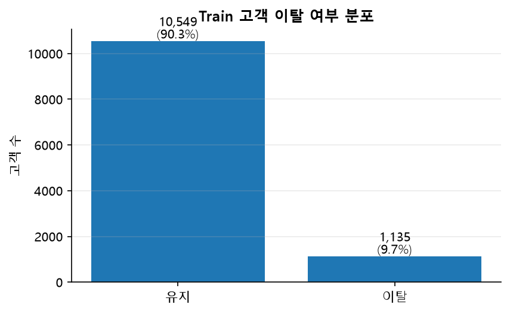
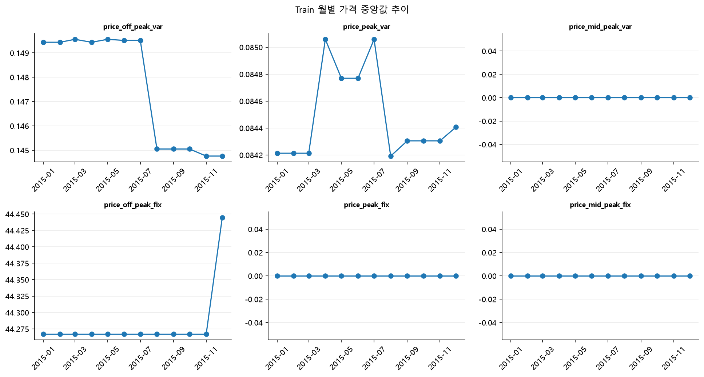
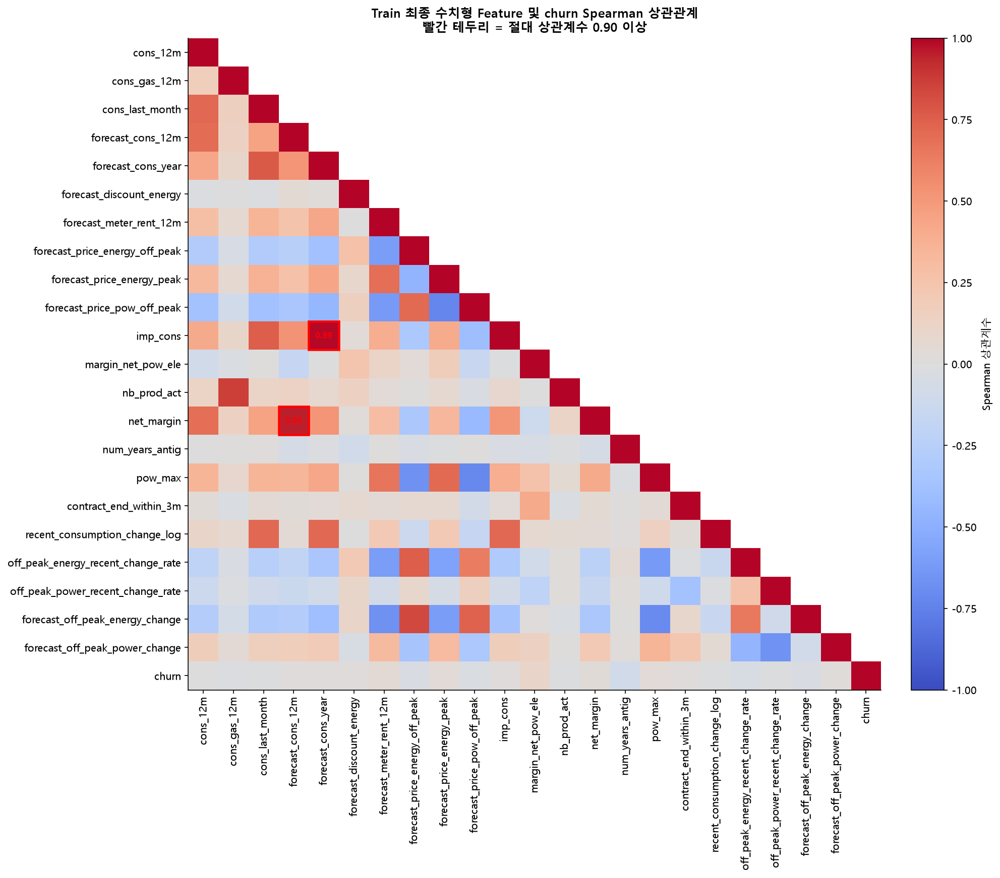

# PowerCo 고객 이탈 예측 데이터 전처리

## 1. 프로젝트 목적

2015년 12월 31일까지 확보된 고객의 계약, 소비, 가격, 수익성 정보를 이용해  
데이터에서 정의된 **향후 3개월 내 고객 이탈 여부**를 예측하기 위한 이진 분류 데이터를 구축한다.

이 프로젝트는 특정 변수가 이탈의 직접 원인임을 증명하는 인과분석이 아니다.  
과거에 이탈한 고객과 유지한 고객의 특성 차이를 모델이 학습하고, 현재 활동 고객별 이탈 가능성을 확률로 계산할 수 있도록 공통 학습 데이터를 만드는 것이 목적이다.

프로젝트에서는 다음 기준일을 사용한다.

- 관측 종료일: 2015-12-31
- 예측 기준일: 2016-01-01
- 예측 구간: 2016-01-01 이상 2016-04-01 미만
- 분석 단위: 고객 1명
- 타깃: `churn`
  - `1`: 향후 3개월 내 이탈
  - `0`: 향후 3개월 내 유지

---

## 2. 파일 역할과 실행 순서

### 파일 역할

| 파일 | 역할 |
|---|---|
| `preprocessing/eda.ipynb` | 원본 구조 확인, 고객 기준 분할, Train EDA, 누수 점검, 전처리 결과 검증, 그래프 저장 |
| `preprocessing/data_preprocessing.py` | 파생변수 생성, 가격 집계, 고객 단위 병합, 중복 제거, `train.csv`·`test.csv` 저장 |
| `preprocessing/preprocessing_report.md` | EDA 결과와 전처리 판단 근거를 정리하고 저장된 그래프를 연결 |

### 실행 순서

1. `data/raw/client_data.csv`와 `data/raw/price_data.csv`를 배치한다.
2. `preprocessing/eda.ipynb`를 위에서 아래로 전체 실행한다.
3. 노트북이 `preprocessing/data_preprocessing.py`를 import한다.
4. 고객 분할본과 병합·파생 완료본은 `data/interim/`에 저장된다.
5. 최종 CSV는 `data/interim/02_*_merged.csv`를 다시 읽어 정제한 뒤 `data/processed/`에 저장된다.
6. 문서용 그래프는 `docs/images/`에 저장된다.
7. 이 문서는 해당 이미지들을 상대경로로 불러온다.

`preprocessing/data_preprocessing.py`만 단독으로 실행해도 같은 공통 데이터 구축이 가능하다.

```bash
python preprocessing/data_preprocessing.py
```

---

## 3. 데이터 저장 계층

### `data/raw`

원본 파일을 그대로 보관하며 수정하지 않는다.

- `client_data.csv`
- `price_data.csv`

### `data/interim`

원본에서 고객 기준 분할, 월별 가격 분리, 파생변수 생성, 고객 단위 병합까지 수행한 중간 CSV를 저장한다.

- `01_train_client.csv`
- `01_test_client.csv`
- `01_train_price.csv`
- `01_test_price.csv`
- `02_train_merged.csv`
- `02_test_merged.csv`

### `data/processed`

`data/interim/02_train_merged.csv`, `02_test_merged.csv`를 다시 읽은 뒤 다음 최종 정제를 수행한다.

- 원본 날짜 컬럼 제외
- 고객 식별자와 타깃을 Feature에서 분리
- Train에서 확인된 명백한 중복 컬럼을 Train/Test에서 동일하게 제거
- 파생변수 계산 중 생긴 무한대를 NaN으로 통일
- 컬럼 순서와 Train/Test 스키마 일치 검증

최종 파일:

- `train.csv`
- `test.csv`

```text
data/raw
→ data/interim/01_*_split.csv
→ data/interim/02_*_merged.csv
→ data/processed/train.csv, test.csv
```


## 4. 원본 데이터

### 4.1 `client_data.csv`

고객 1명당 1행으로 구성된 고객·계약·소비·수익성 데이터다.

현재 원본 기준:

- 고객 수: 14,606명
- 타깃 포함 컬럼 수: 26개
- 고객 기본키: `id`

주요 변수군:

- 계약 날짜: `date_activ`, `date_end`, `date_modif_prod`, `date_renewal`
- 범주형: `channel_sales`, `origin_up`, `has_gas`
- 소비량: `cons_12m`, `cons_gas_12m`, `cons_last_month`, `imp_cons`
- 예상 소비·가격: `forecast_*`
- 수익성: `margin_gross_pow_ele`, `margin_net_pow_ele`, `net_margin`
- 계약전력·상품: `pow_max`, `nb_prod_act`
- 타깃: `churn`

### 4.2 `price_data.csv`

고객별 월별 가격 이력 데이터다.

현재 원본 기준:

- 행 수: 193,002행
- 기본키: `id + price_date`
- 주요 가격 변수:
  - `price_off_peak_var`
  - `price_peak_var`
  - `price_mid_peak_var`
  - `price_off_peak_fix`
  - `price_peak_fix`
  - `price_mid_peak_fix`

월별 가격 데이터를 고객 데이터에 그대로 병합하면 고객 행이 여러 배로 증가한다.  
따라서 가격 이력은 먼저 고객별 1행으로 집계한 뒤 병합한다.

---

## 5. Train/Test 분할

고객을 먼저 Train과 Test로 분할하고, 각 고객의 모든 월별 가격 기록을 동일한 데이터셋으로 보낸다.

- Train: 11,684명
- Test: 2,922명
- 분할 비율: 80:20
- `random_state`: 42
- `stratify`: `churn`

이 방식은 동일 고객의 일부 가격 이력이 Train에, 나머지가 Test에 들어가는 누수를 방지한다.

### Test 봉인 원칙

Train/Test 분할 이후 다음 판단은 Train만 사용한다.

- 결측 및 이상값 점검
- 이탈률 비교
- 파생변수 채택
- 중복 컬럼 판단
- 상관관계 확인

Test에는 Train에서 확정한 동일한 변환 규칙만 적용한다.

---

## 6. Train EDA

### 6.1 결측치

원본 데이터에서는 실제 NaN과 문자열로 기록된 의미상 결측을 구분한다.

- 빈 문자열: 실제 NaN으로 통일
- 문자열 `MISSING`: 하나의 범주로 유지
- 숫자 `0`: 결측치로 간주하지 않음

`channel_sales`와 `origin_up`의 `MISSING`은 값이 없다는 상태 자체가 고객 특성일 수 있으므로 삭제하거나 최빈값으로 대체하지 않는다.

### 6.2 중복 및 값 범위

다음 항목을 확인한다.

- 전체 행 중복
- `client_data.id` 중복
- `price_data.id + price_date` 중복
- 수치형 무한대
- 비음수 기대 변수의 음수
- `churn`이 0 또는 1인지
- `has_gas`가 `t` 또는 `f`인지

이상값은 IQR 기준으로 후보만 확인하고 자동 삭제하지 않는다.  
큰 소비량이나 마진 값이 실제 대형 고객을 나타낼 수 있기 때문이다.

### 6.3 타깃 불균형

Train의 이탈 고객 비율은 약 9.7%로 유지 고객보다 적다.



따라서 모델 평가에서 Accuracy만 사용하지 않는다.  
Recall, Precision, F1-score, PR-AUC를 함께 확인하고, 실제 운영 목적에 맞게 임계값을 조정한다.

### 6.4 변수와 이탈의 관계

Train에서 다음을 확인한다.

- 수치형 변수의 평균·중앙값·왜도·0 비율
- IQR 기반 이상값 후보
- 범주형 변수별 고객 수와 이탈률
- 수치형 변수와 `churn`의 Spearman 상관계수

이 결과는 변수의 직접적인 인과효과를 의미하지 않는다.  
모델링 후보 변수의 분포와 예측 신호를 탐색하기 위한 것이다.

### 6.5 가격 이력

고객별 가격 관측 개월 수를 확인하고, 월별 가격 중앙값 추이를 검토한다.



가격 데이터는 예측 기준일 이전 기록만 사용한다.

---

## 7. 예측 기준일과 데이터 누수

### 기준

- `MODEL_REFERENCE_DATE = 2016-01-01`
- `PREDICTION_END_DATE = 2016-04-01`
- 가격 데이터는 `price_date < 2016-01-01`인 기록만 사용

원본 날짜 컬럼은 파생변수 생성에 사용한 뒤 최종 모델 Feature에서 제외한다.

### 사용 전제가 필요한 변수

`date_end`는 기준일 이전에 이미 등록된 계약 종료 예정일이라는 전제에서 사용한다.

`forecast_*`, `imp_cons`, `margin_*` 변수도 기준일 시점에 이미 생성되어 조회 가능하다는 전제에서 사용한다.  
실제 원천 시스템에서 기준일 이후 생성된 값이라면 모델 입력에서 제거해야 한다.

---

## 8. 파생변수

총 6개의 공통 파생변수를 생성한다.

### 8.1 `contract_end_within_3m`

| 항목 | 내용 |
|---|---|
| 사용 데이터 | `client_data` |
| 원본 컬럼 | `date_end` |
| 계산식 | `2016-01-01 <= date_end < 2016-04-01`이면 1, 아니면 0 |
| 생성 이유 | 예측 구간 안에 계약 종료가 예정된 고객은 갱신 여부와 이탈 위험을 함께 확인할 필요가 있음 |
| 의미 | 1이면 향후 3개월 안에 계약 종료 예정 |
| 주의사항 | `date_end`가 기준일 이전에 등록된 예정일이라는 전제가 필요하며, 원본이 결측이면 파생변수도 NaN으로 유지 |

### 8.2 `recent_consumption_change_log`

| 항목 | 내용 |
|---|---|
| 사용 데이터 | `client_data` |
| 원본 컬럼 | `cons_last_month`, `cons_12m` |
| 계산식 | `log1p(cons_last_month) - log1p(cons_12m / 12)` |
| 생성 이유 | 최근 한 달 소비가 지난 12개월의 월평균에서 얼마나 달라졌는지 확인 |
| 의미 | 양수이면 최근 소비가 과거 월평균보다 높고, 음수이면 낮음 |
| 주의사항 | Train에서 소비량 음수가 없는지 먼저 확인하며, 로그 차이는 비율이 아니라 상대적 변화 신호 |

### 8.3 `off_peak_energy_recent_change_rate`

| 항목 | 내용 |
|---|---|
| 사용 데이터 | `price_data` |
| 원본 컬럼 | `price_off_peak_var`, `price_date` |
| 계산식 | `(최근 3개월 평균 - 이전 9개월 평균) / abs(이전 9개월 평균)` |
| 생성 이유 | 최근 비첨두 에너지 단가 변화가 이탈 예측에 주는 신호를 반영 |
| 의미 | 양수이면 최근 평균 가격 상승, 음수이면 하락 |
| 주의사항 | 이전 평균이 0이면 비율을 정의할 수 없으므로 NaN 유지 |

### 8.4 `off_peak_power_recent_change_rate`

| 항목 | 내용 |
|---|---|
| 사용 데이터 | `price_data` |
| 원본 컬럼 | `price_off_peak_fix`, `price_date` |
| 계산식 | `(최근 3개월 평균 - 이전 9개월 평균) / abs(이전 9개월 평균)` |
| 생성 이유 | 최근 비첨두 계약전력 가격 변화 신호를 반영 |
| 의미 | 양수이면 최근 평균 계약전력 가격 상승, 음수이면 하락 |
| 주의사항 | 이전 평균이 0이면 NaN 유지 |

### 8.5 `forecast_off_peak_energy_change`

| 항목 | 내용 |
|---|---|
| 사용 데이터 | `client_data + price_data` |
| 원본 컬럼 | `forecast_price_energy_off_peak`, 고객별 마지막 `price_off_peak_var` |
| 계산식 | `(예상 가격 - 최근 실제 가격) / abs(최근 실제 가격)` |
| 생성 이유 | 현재 가격 대비 향후 예상 에너지 가격 변화 신호를 반영 |
| 의미 | 양수이면 예상 가격이 최근 실제 가격보다 높음 |
| 주의사항 | 최근 실제 가격이 0이면 NaN 유지하며, 예상 가격이 기준일 시점에 생성된 값이어야 함 |

### 8.6 `forecast_off_peak_power_change`

| 항목 | 내용 |
|---|---|
| 사용 데이터 | `client_data + price_data` |
| 원본 컬럼 | `forecast_price_pow_off_peak`, 고객별 마지막 `price_off_peak_fix` |
| 계산식 | `(예상 가격 - 최근 실제 가격) / abs(최근 실제 가격)` |
| 생성 이유 | 현재 가격 대비 향후 예상 계약전력 가격 변화 신호를 반영 |
| 의미 | 양수이면 예상 가격이 최근 실제 가격보다 높음 |
| 주의사항 | 최근 실제 가격이 0이면 NaN 유지하며, 예상 가격이 기준일 시점에 생성된 값이어야 함 |

### 제외한 후보

`forecast_consumption_change_rate`는 생성하지 않는다.

- `forecast_cons_12m`과 `cons_12m`의 단위 일치가 확인되지 않음
- 가격 변화와 이탈의 관계를 확인하는 핵심 주제와 직접적이지 않음
- 단위가 불확실한 비율을 추가하면 해석 오류가 생길 수 있음

---

## 9. 가격 집계와 고객 단위 병합

가격 데이터는 다음 순서로 처리한다.

1. 기준일 이후 가격 기록 제거
2. 최근 3개월과 이전 기간 구분
3. 비첨두 에너지·계약전력 가격 변화율 계산
4. 고객별 마지막 실제 가격 보관
5. 고객 데이터와 `one_to_one` 방식으로 병합
6. 예상 가격과 마지막 실제 가격의 변화율 계산
7. 계산용 마지막 가격 컬럼 제거

병합 전후에 다음 조건을 검증한다.

- 고객 행 수가 변하지 않음
- 고객 ID가 고유함
- 병합 전후 고객 집합이 동일함
- Train과 Test의 최종 컬럼 구성이 동일함

---

## 10. 중복 및 불필요 컬럼 제거

다음 컬럼은 최종 모델 Feature에서 제외한다.

- `id`: 고객 식별과 예측 결과 연결용으로 CSV에는 유지
- `churn`: 타깃이므로 Feature에서 제외
- 날짜 원본 컬럼 4개: 기준일 기반 파생변수 생성 후 제외
- `margin_gross_pow_ele`: Train에서 `margin_net_pow_ele`과 약 99.9914% 동일하여 제거
- Train에서 값과 결측 위치가 완전히 같은 정확한 중복 컬럼

고객 행은 삭제하지 않는다.

---

## 11. 결측치와 무한대 처리

가격 변화율의 분모가 0이면 계산 결과를 0으로 바꾸지 않는다.

- 0: 변화가 없다는 실제 값
- NaN: 비율을 정의할 수 없음

두 의미가 다르기 때문에 구조적 결측은 NaN으로 유지한다.

현재 원본 기준 파생변수 결측:

| 변수 | Train NaN | Test NaN |
|---|---:|---:|
| `off_peak_energy_recent_change_rate` | 16 | 데이터 실행 결과 확인 |
| `off_peak_power_recent_change_rate` | 84 | 데이터 실행 결과 확인 |
| `forecast_off_peak_energy_change` | 22 | 데이터 실행 결과 확인 |
| `forecast_off_peak_power_change` | 90 | 데이터 실행 결과 확인 |

현재 기준으로 파생변수 중 하나 이상이 결측인 고객은 Train 90명, Test 22명이다.

이 단계에서는 결측치 대체를 하지 않는다.  
모델링 단계에서 수치형 결측치는 각 교차검증 Train Fold 안에서 중앙값으로 대체하고 결측 지시변수를 추가한다.

```python
SimpleImputer(strategy="median", add_indicator=True)
```

---

## 12. 최종 상관관계 확인

중복 제거 후 Train의 최종 수치형 Feature와 `churn`의 Spearman 상관관계를 확인한다.



절대 상관계수 0.90 이상 조합은 빨간 테두리로 표시한다.  
상관관계가 높다는 사실만으로 자동 삭제하지 않고, 중복성·해석 가능성·모델 종류를 함께 고려한다.

---

## 13. 최종 출력 데이터

### `data/processed/train.csv`

- 행 수: 11,684
- 전체 컬럼 수: 27
- 구성: `id` + 25개 Feature + `churn`

### `data/processed/test.csv`

- 행 수: 2,922
- 전체 컬럼 수: 27
- 구성: `id` + 25개 Feature + `churn`

### Feature 구성

- 수치형 Feature: 22개
- 범주형 Feature: 3개
  - `channel_sales`
  - `has_gas`
  - `origin_up`
- 파생변수: 6개

최종 CSV에서는 다음을 유지한다.

- 범주형 문자열 원본
- 수치형 원래 단위
- 구조적 NaN
- 고객 식별용 `id`
- 평가용 `churn`

다음 처리는 적용하지 않는다.

- 결측치 대체
- 원-핫 인코딩
- StandardScaler
- PCA
- SMOTE
- 하이퍼파라미터 탐색

---

## 14. 이후 모델링 단계

`train.csv`로 Stratified 5-Fold 교차검증을 수행하고, `test.csv`는 최종 한 번만 평가한다.

권장 비교 모델:

1. DummyClassifier
2. Logistic Regression
3. Logistic Regression + PCA
4. Random Forest
5. XGBoost
6. LightGBM

모델별 Pipeline 원칙:

- Logistic Regression: 중앙값 대체 + 결측 지시변수 + One-Hot Encoding + StandardScaler
- Logistic Regression + PCA: 위 처리 후 PCA
- Random Forest: 중앙값 대체 + 결측 지시변수 + One-Hot Encoding, 스케일링 불필요
- XGBoost / LightGBM: 중앙값 대체 + 결측 지시변수 + 범주형 처리, 스케일링 불필요

Test의 `churn`은 예측 입력에 넣지 않고, 모델 예측을 마친 뒤 성능 평가에만 사용한다.
