# PowerCo 데이터 전처리 보고서

## 1. 보고서 개요

### 1.1 목적

본 보고서는 **PowerCo 고객 이탈 예측 및 고위험 고객 선별** 프로젝트에서 수행한 데이터 전처리 과정을 정리한 문서임.

전처리의 목적은 서로 다른 단위로 구성된 고객 데이터와 월별 가격 데이터를 **고객 1명당 1행의 모델링 데이터**로 통합하고, 예측 기준일 이후의 정보가 모델에 유입되지 않도록 통제하면서 재현 가능한 학습 데이터를 만드는 것임.

본 프로젝트의 전처리는 다음 세 가지 원칙을 기준으로 설계함.

1. **고객 단위 정합성 유지**  
   동일 고객의 정보가 Train과 Test에 동시에 포함되지 않도록 고객 ID를 먼저 분할함.

2. **시간 기준 통제**  
   `2016-01-01`을 예측 기준일로 설정하고, 가격 데이터는 기준일 이전 정보만 사용함.

3. **데이터 누수 방지**  
   중앙값 대체, One-Hot Encoding, Scaling처럼 데이터로부터 학습되는 변환은 CSV 생성 단계가 아니라 모델 Pipeline 내부에서 수행함.

---

## 2. 분석 기준 및 데이터 구성

### 2.1 분석 기준

| 항목 | 기준                                      |
|---|-----------------------------------------|
| 분석 단위 | 고객 1명                                   |
| 예측 기준일 | `2016-01-01`                            |
| 예측 구간 | `2016-01-01` 이상 ~ `2016-04-01` 미만(3개월)  |
| Target | `churn` (`0`: 유지, `1`: 이탈)              |
| Train/Test | 80:20 Stratified Split                  |
| Random State | `42`                                    |
| Train 고객 수 | 11,684명                                 |
| Test 고객 수 | 2,922명                                  |
| 최종 모델 Feature | 37개                                     |
| 최종 범주형 Feature | `channel_sales`, `has_gas`, `origin_up` |

### 2.2 원본 데이터

프로젝트에서는 두 개의 원본 CSV를 사용함.

#### `client_data.csv`

- 크기: **14,606행 × 26열**
- 고객 1명당 1행
- 주요 정보
  - 계약 시작·종료·갱신·상품 변경 날짜
  - 전기·가스 소비량
  - 향후 소비량 및 가격 예측값
  - 순마진과 계약전력
  - 판매 채널과 계약 유입 경로
  - 활성 상품 수와 고객 유지 연차
  - 이탈 여부 `churn`

#### `price_data.csv`

- 크기: **193,002행 × 8열**
- 고객별 월별 가격 이력
- 한 고객이 여러 행을 가짐
- 주요 정보
  - 비첨두·첨두·중간 시간대 에너지 가격
  - 비첨두·첨두·중간 시간대 전력 가격

두 데이터는 분석 단위가 다름.

```text
client_data.csv
고객 1명 = 1행

price_data.csv
고객 1명 = 여러 월의 가격 행
```

따라서 `price_data.csv`를 그대로 병합하지 않고 **월별 가격 이력을 고객 단위 Feature로 집계한 뒤 고객 데이터와 결합**함.

---

## 3. 초기 데이터 점검 결과

### 3.1 Target 분포

전체 고객 중 이탈 고객은 약 **9.7%**로 유지 고객보다 적은 불균형 구조를 가짐.

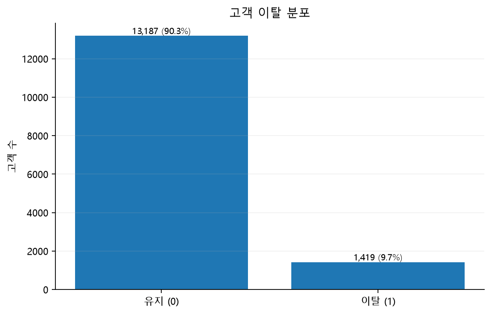

따라서 Train/Test 분할 시 `stratify=y`를 적용해 이탈 비율을 유지함.

이 단계에서 Oversampling 또는 Undersampling으로 원본 고객 수를 변경하지 않음. 클래스 불균형 대응 방법은 모델링 단계에서 별도 실험 대상으로 다뤘으며, 데이터 전처리 단계에서는 **원래 고객 모집단과 Target 분포를 보존**함.

### 3.2 결측치 점검

`client_data.csv`와 `price_data.csv`를 `isna()` 기준으로 확인한 결과 **원본에서 직접적인 결측값은 확인되지 않음.**

| 점검 항목 | 결과 |
|---|---|
| `client_data.csv` 직접 결측값 | 없음 |
| `price_data.csv` 직접 결측값 | 없음 |
| 원본 결측 행 삭제 | 수행하지 않음 |
| 원본 결측값 사전 대체 | 수행하지 않음 |

따라서 원본 데이터에 대해 평균·중앙값·최빈값 등으로 값을 채우는 처리는 수행하지 않음.

다만 원본에 결측이 없더라도 전처리 과정에서는 다음과 같은 이유로 `NaN`이 새롭게 발생할 수 있음.

- 잘못된 날짜 문자열의 날짜 변환 실패
- 비율 계산 시 분모가 0인 경우
- 계산 결과가 `+inf`, `-inf`인 경우
- 향후 실제 예측 데이터에서 일부 값이 누락된 경우

따라서 **현재 데이터의 결측을 보정하기 위해서가 아니라 예외 상황에 안전하게 대응하기 위해** 결측 처리 로직을 Pipeline에 유지함.

### 3.3 기본키와 중복 점검

두 원본 데이터의 기본키를 다음과 같이 정의함.

| 데이터 | 기본키 |
|---|---|
| `client_data.csv` | `id` |
| `price_data.csv` | `id + price_date` |

다음 항목을 코드에서 검증함.

- 고객 데이터의 전체 행 중복
- 고객 ID 중복
- 가격 데이터의 전체 행 중복
- `id + price_date` 중복
- 고객 데이터와 가격 데이터의 고객 집합 관계
- 가격 이력이 없는 고객 존재 여부

기본키 중복 또는 가격 이력이 없는 고객이 발견되면 임의로 제거하지 않고 **오류를 발생시켜 데이터 문제를 먼저 확인하도록 설계**함.

### 3.4 원본 고객 데이터에서 확인한 주요 이탈 패턴

모델 학습이나 Feature Importance를 사용하기 전에, `client_data.csv`의 원본 고객 정보와 Target만으로 이탈률 차이를 확인함.

이 단계의 목적은 특정 변수가 이탈의 원인이라고 단정하는 것이 아니라, **원본 데이터에서 어떤 고객 특성에 따라 이탈률 차이가 관찰되는지 탐색적으로 확인하는 것**임.

#### 3.4.1 고객 유지 연차와 이탈률

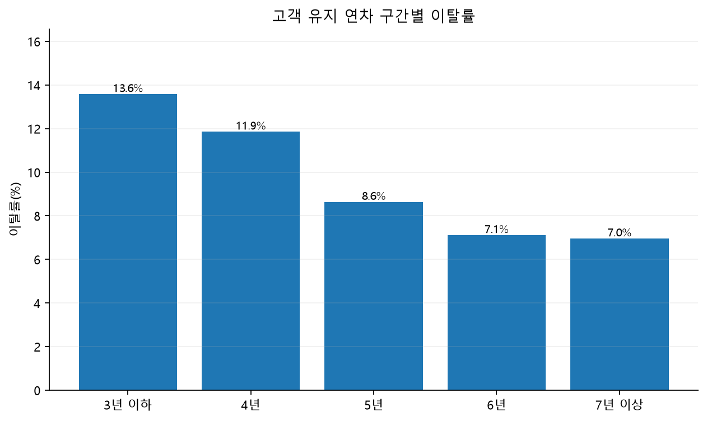

고객 유지 연차(`num_years_antig`)를 구간화해 확인한 결과, **유지 연차가 짧은 고객군에서 상대적으로 높은 이탈률**이 관찰됨.

- 3년 이하: 약 **13.6%**
- 4년: 약 **11.9%**
- 5년: 약 **8.6%**
- 6년: 약 **7.1%**
- 7년 이상: 약 **7.0%**

즉 장기 고객일수록 이탈률이 낮아지는 방향의 패턴이 확인되며, 고객과의 관계 지속 기간이 이탈 위험을 구분하는 중요한 탐색 변수일 가능성을 보여줌.

#### 3.4.2 전력 계약 순마진 구간과 이탈률

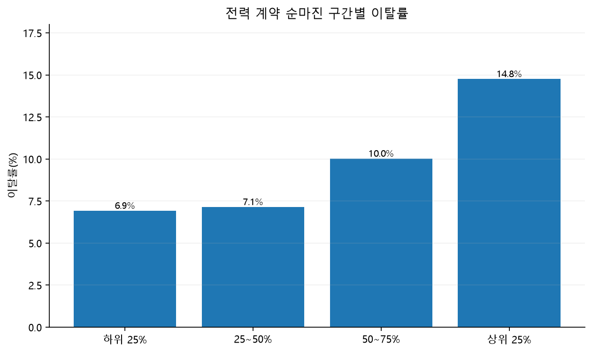

전력 계약 순마진(`margin_net_pow_ele`)을 고객 수 기준 4개 구간으로 나누어 확인한 결과, **상위 순마진 구간에서 이탈률이 더 높게 관찰됨.**

- 하위 25%: 약 **6.9%**
- 25~50%: 약 **7.2%**
- 50~75%: 약 **10.1%**
- 상위 25%: 약 **14.7%**

특히 상위 25% 구간의 이탈률은 하위 구간보다 뚜렷하게 높아, 단순 소비량뿐 아니라 고객별 계약 수익 구조와 이탈 여부의 연관성도 함께 살펴볼 필요가 있음을 확인함.

#### 3.4.3 가스 상품 보유 여부와 이탈률

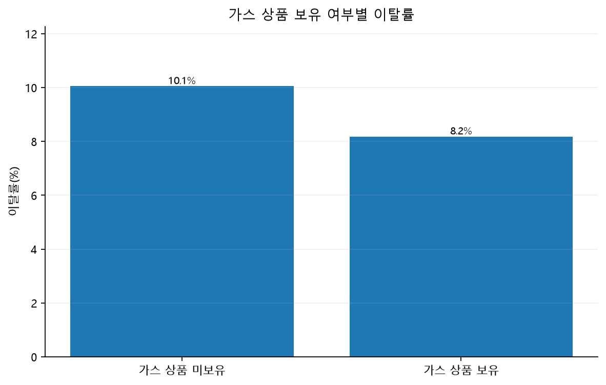

가스 상품 보유 여부(`has_gas`)에 따라 이탈률을 비교한 결과, **가스 상품을 보유한 고객군의 이탈률이 상대적으로 낮게 관찰됨.**

- 가스 상품 미보유: 약 **10.1%**
- 가스 상품 보유: 약 **8.2%**

이는 복수 상품 이용 여부와 고객 유지 간에 차이가 존재할 가능성을 보여주는 탐색 결과임.

위 세 패턴은 모두 **단순 집계 기반의 연관 패턴**이며, 해당 변수가 이탈을 직접 발생시키는 인과관계를 의미하지 않음.

---

## 4. 전체 전처리 흐름

```text
data/raw/
├── client_data.csv
└── price_data.csv
        ↓
1. 스키마·필수 컬럼·기본키 검증
        ↓
2. 날짜형 변환
        ↓
3. 고객 ID 기준 Train/Test 분할
        ↓
4. 동일 고객의 모든 가격 이력을 같은 Split에 배정
        ↓
5. 기준일 이전 가격 이력만 사용
        ↓
6. 월별 가격 → 고객 단위 가격 변화 Feature 집계
        ↓
7. 고객 데이터 + 가격 Feature 1:1 병합
        ↓
8. A0 기본 Feature Engineering
        ↓
9. 날짜 원본·중복 정보·보조 컬럼 제거
        ↓
10. A0 25개 Feature 생성
        ↓
11. 계약 생애주기 A3 Feature 12개 추가
        ↓
12. 최종 37개 Feature 생성
        ↓
13. 모델 Pipeline
    ├─ 수치형: Median Imputation + Missing Indicator
    ├─ 범주형: MISSING + One-Hot Encoding
    └─ Logistic Regression: StandardScaler
```

전처리 단계는 크게 두 파일로 분리함.

| 코드 | 역할 |
|---|---|
| `preprocessing/data_preprocessing.py` | 원본 검증, 분할, 가격 집계, A0 생성 |
| `preprocessing/preprocessing_plus.py` | 계약 날짜 기반 A3 Feature 12개 추가, 최종 데이터 확정 |

---

## 5. 원본 로드와 스키마 검증

### 5.1 필수 컬럼 검증

원본 CSV를 읽은 뒤 모델링과 Feature Engineering에 필요한 필수 컬럼이 존재하는지 확인함.

필수 컬럼이 없을 경우 이후 단계에서 조용히 누락된 상태로 진행하지 않고 즉시 오류를 발생시킴.

### 5.2 프로젝트 상대경로 사용

개인 PC의 절대경로를 코드에 직접 작성하지 않고 프로젝트 루트의 `data/raw`를 기준으로 파일을 찾도록 구성함.

```text
프로젝트 루트/
└── data/
    └── raw/
        ├── client_data.csv
        └── price_data.csv
```

이를 통해 팀원마다 프로젝트 위치가 달라도 동일한 코드를 실행할 수 있음.

---

## 6. 날짜형 변환

### 6.1 원래 상태

CSV에서 다음 날짜 컬럼은 문자열 형태로 읽힘.

- `date_activ`
- `date_end`
- `date_modif_prod`
- `date_renewal`
- `price_date`

문자열 상태에서는 날짜 간 차이, 기준일 이전·이후 여부, 계약 잔여기간 등을 안정적으로 계산하기 어려움.

### 6.2 처리 방법

다음 방식으로 날짜형으로 변환함.

```python
pd.to_datetime(column, errors="coerce")
```

변환할 수 없는 날짜는 임의의 날짜로 보정하지 않고 `NaT`로 처리하도록 함.

원본 날짜 문자열 자체는 최종 모델 Feature로 직접 사용하지 않고, 이후 기준일을 중심으로 기간 또는 여부 변수로 변환함.

---

## 7. 고객 기준 Train/Test 분할

### 7.1 고객을 먼저 분할한 이유

`price_data.csv`는 고객 1명에게 여러 월의 행이 존재함.

가격 행을 먼저 무작위로 분할하면 다음 문제가 발생할 수 있음.

```text
고객 A의 1~6월 가격 → Train
고객 A의 7~12월 가격 → Test
```

이 경우 같은 고객의 정보가 Train과 Test에 동시에 존재하므로 고객 단위 정보 누수가 발생함.

### 7.2 처리 방법

먼저 `client_data.csv`를 고객 단위로 80:20 분할함.

```text
client_data
        ↓
Stratified Train/Test Split
        ↓
Train 고객 ID 확정
Test 고객 ID 확정
        ↓
해당 고객의 모든 가격 이력을 동일 Split에 배정
```

분할 결과:

| 구분 | 고객 수 |
|---|---:|
| Train | 11,684 |
| Test | 2,922 |

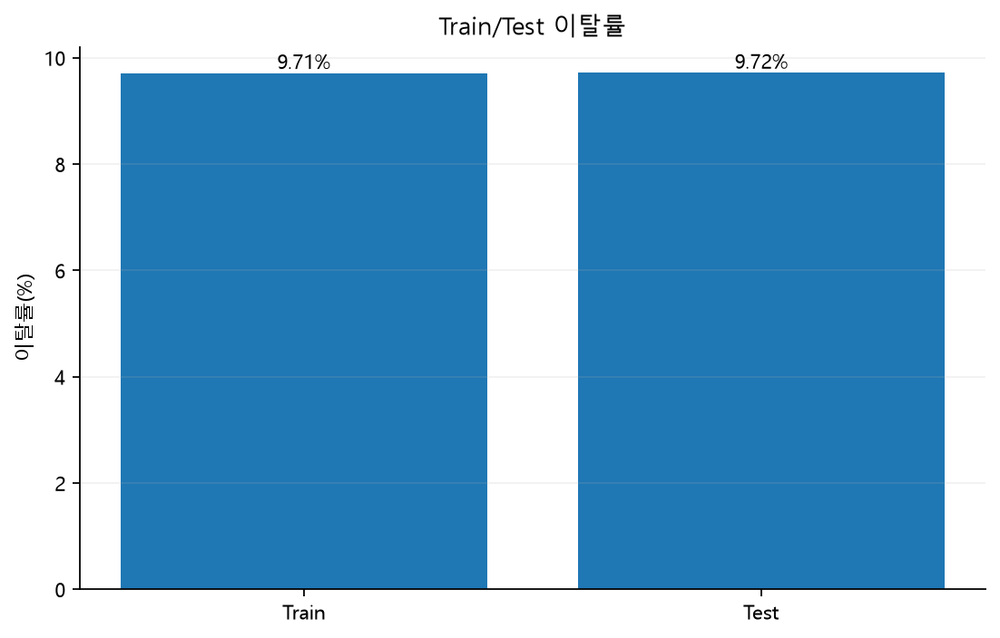

분할 후 다음 조건을 검증함.

- Train/Test 고객 ID 교집합 = 0
- 모든 고객이 정확히 한 Split에만 존재
- Train 고객의 모든 가격 이력이 Train에 존재
- Test 고객의 모든 가격 이력이 Test에 존재
- Stratified Split으로 이탈 비율 유지

---

## 8. 결측치 및 계산 불가능 값 처리

### 8.1 원본 결측치

원본에는 `isna()` 기준 직접 결측값이 없어 행 삭제나 값 대체를 수행하지 않음.

### 8.2 범주형 공백 정규화

다음 범주형 변수에서 공백 문자열이 존재할 가능성에 대비해 빈 문자열만 `NaN`으로 통일하도록 함.

- `channel_sales`
- `origin_up`
- `has_gas`

이는 실제 값을 임의로 변경하는 것이 아니라 빈 문자열을 명시적 결측 표현으로 정규화하는 방어적 처리임.

### 8.3 비율 계산

비율 및 변화율 계산은 `safe_ratio()`를 사용함.

```text
분모 = 0
→ NaN

결과 = +inf / -inf
→ NaN
```

무한대 값을 그대로 모델에 전달하지 않도록 처리함.

### 8.4 모델 Pipeline의 결측 안전장치

최종 모델 학습 단계에서는 다음 처리를 Pipeline 내부에 둠.

#### 수치형

```python
SimpleImputer(
    strategy="median",
    add_indicator=True
)
```

- 실제 결측이 발생한 경우 해당 학습 Fold의 중앙값으로 대체
- 결측 여부를 Missing Indicator로 추가
- Validation/Test에는 학습 Fold에서 결정된 규칙만 적용

현재 입력 데이터에 결측이 없다면 값은 실질적으로 변경되지 않음.

#### 범주형

```text
NaN
→ "MISSING"
→ One-Hot Encoding
```

`MISSING` 범주는 현재 원본 결측을 채우기 위한 필수 조치라기보다 **향후 신규 데이터에서 발생할 수 있는 누락에 대비한 안전장치**임.

---

## 9. 중복 및 불필요 정보 처리

### 9.1 고객 행은 삭제하지 않음

전처리 과정에서 임의의 고객 행을 제거하지 않음.

Train과 Test의 고객 수는 최초 분할 이후 유지되도록 검증함.

### 9.2 중복 Feature 탐지

Train 데이터를 기준으로 값과 결측 위치가 완전히 동일한 컬럼을 탐지함.

정확히 동일한 Feature가 발견되면 Train에서 탐지한 동일 컬럼을 Test에도 동일하게 제거함.

### 9.3 마진 중복 정보 제거

다음 두 변수의 값이 사실상 동일한지 Train 데이터에서 확인함.

- `margin_gross_pow_ele`
- `margin_net_pow_ele`

두 컬럼의 동일 비율이 99.9% 이상인 경우 `margin_gross_pow_ele`를 중복 정보로 판단해 제거하도록 설계함.

최종 A0 Feature가 25개로 구성되는 과정에서는 `margin_gross_pow_ele`가 중복 정보로 제외되고 `margin_net_pow_ele`를 유지함.

### 9.4 모델에서 제외한 컬럼

다음 컬럼은 최종 Feature에서 제외함.

| 컬럼 | 제외 이유 |
|---|---|
| `id` | 고객 식별자이며 예측 Feature가 아님 |
| `churn` | Target이므로 입력 Feature에서 분리 |
| `date_activ` | 날짜 파생변수 생성 후 원본 날짜 제거 |
| `date_end` | 날짜 파생변수 생성 후 원본 날짜 제거 |
| `date_modif_prod` | 날짜 파생변수 생성 후 원본 날짜 제거 |
| `date_renewal` | 날짜 파생변수 생성 후 원본 날짜 제거 |
| `margin_gross_pow_ele` | `margin_net_pow_ele`와 중복성이 매우 높아 제거 |
| `__price_off_peak_var_last` | 교차 Feature 생성용 임시 보조 컬럼 |
| `__price_off_peak_fix_last` | 교차 Feature 생성용 임시 보조 컬럼 |

---

## 10. 이상값 처리 원칙

소비량, 마진, 계약전력과 같은 수치형 변수는 분포가 치우쳐 있거나 매우 큰 값을 가질 수 있음.

그러나 에너지 고객 데이터에서는 큰 값이 오류가 아니라 실제 대형 고객의 사용량 또는 계약 규모일 수 있음.

따라서 단순 IQR 기준으로 고객 행을 제거하지 않음.

```text
값이 크다
→ 자동으로 이상값 삭제하지 않음
```

대신 다음과 같이 처리함.

- 데이터 타입과 계산 가능 여부 검증
- 로그 파생변수 적용 전 소비량 음수 여부 검증
- 분모 0을 `NaN`으로 처리
- `+inf`, `-inf`를 `NaN`으로 통일
- 최종 결과에서 무한대 셀 0개인지 검증

### 로그 파생변수 사전 검증

`recent_consumption_change_log` 생성 전 Train의 `cons_12m`, `cons_last_month`에 음수가 존재하는지 확인함.

음수가 존재하면 `log1p` 기반 Feature를 그대로 생성하지 않고 오류를 발생시키도록 함.

---

## 11. 월별 가격 데이터의 고객 단위 집계

### 11.1 원래 상태

`price_data.csv`는 고객별 월별 가격 이력이므로 한 고객이 여러 행을 가짐.

이를 그대로 고객 데이터에 병합하면 고객 행이 가격 월 수만큼 복제됨.

### 11.2 기준일 이후 정보 제외

가격 Feature에는 다음 조건을 만족하는 데이터만 사용함.

```text
price_date < 2016-01-01
```

즉 예측 기준일 이후의 가격 정보는 가격 Feature 생성에 사용하지 않음.

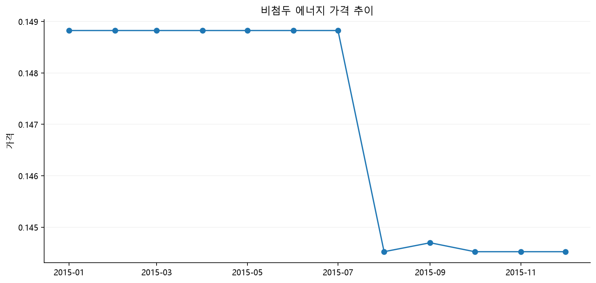

### 11.3 실제 사용한 가격 변수

원본 가격 데이터에는 비첨두·첨두·중간 시간대 가격이 포함되어 있지만, A0의 시간 변화 Feature는 다음 두 변수로 구성함.

- `price_off_peak_var`: 비첨두 에너지 가격
- `price_off_peak_fix`: 비첨두 전력 가격

각 고객에 대해:

1. 기준일 직전 최근 3개월 평균
2. 그 이전 기간 평균
3. 기준일 이전 마지막 가격

을 계산함.

가격 변화율은 다음과 같음.

```text
(최근 3개월 평균 - 이전 기간 평균)
-----------------------------------
        |이전 기간 평균|
```

생성 Feature:

- `off_peak_energy_recent_change_rate`
- `off_peak_power_recent_change_rate`

월별 여러 가격 행은 최종적으로 **고객 1명당 1행의 가격 변화 Feature**로 축약됨.

---

## 12. A0 기본 Feature Engineering

고객 원본 정보와 고객 단위 가격 집계 결과를 결합해 A0 기준선을 생성함.

### 12.1 고객 데이터 기반 Feature

#### `contract_end_within_3m`

예측 기준일 이후 3개월 안에 계약 종료가 예정되어 있는지를 나타냄.

```text
2016-01-01 ≤ date_end < 2016-04-01
```

#### `recent_consumption_change_log`

최근 1개월 소비량을 과거 12개월 월평균 소비량과 비교하는 변화 신호임.

```text
log1p(cons_last_month)
-
log1p(cons_12m / 12)
```

절대 소비 규모가 큰 고객과 작은 고객을 직접 비교하기보다 최근 소비가 평소 수준에서 얼마나 달라졌는지를 나타내기 위해 생성함.

### 12.2 가격 이력 기반 Feature

- `off_peak_energy_recent_change_rate`
- `off_peak_power_recent_change_rate`

최근 3개월 가격이 과거 기간에 비해 얼마나 변했는지를 나타냄.

### 12.3 고객 예측가격과 실제 최근가격의 교차 Feature

고객 데이터의 예측 가격과 가격 이력의 마지막 실제 가격을 비교해 다음 변수를 생성함.

#### `forecast_off_peak_energy_change`

```text
(forecast_price_energy_off_peak - 최근 실제 비첨두 에너지 가격)
---------------------------------------------------------------
             |최근 실제 비첨두 에너지 가격|
```

#### `forecast_off_peak_power_change`

```text
(forecast_price_pow_off_peak - 최근 실제 비첨두 전력 가격)
----------------------------------------------------------
          |최근 실제 비첨두 전력 가격|
```

교차 Feature 생성 후 최근 실제가격을 담기 위해 사용했던 임시 보조 컬럼은 제거함.

### 12.4 A0 결과

A0에서 새로 생성된 파생변수는 총 6개임.

| 구분 | Feature |
|---|---|
| 계약 | `contract_end_within_3m` |
| 소비 변화 | `recent_consumption_change_log` |
| 가격 변화 | `off_peak_energy_recent_change_rate` |
| 가격 변화 | `off_peak_power_recent_change_rate` |
| 예측-실제 가격 차이 | `forecast_off_peak_energy_change` |
| 예측-실제 가격 차이 | `forecast_off_peak_power_change` |

최종 A0 모델 Feature 수는 **25개**임.

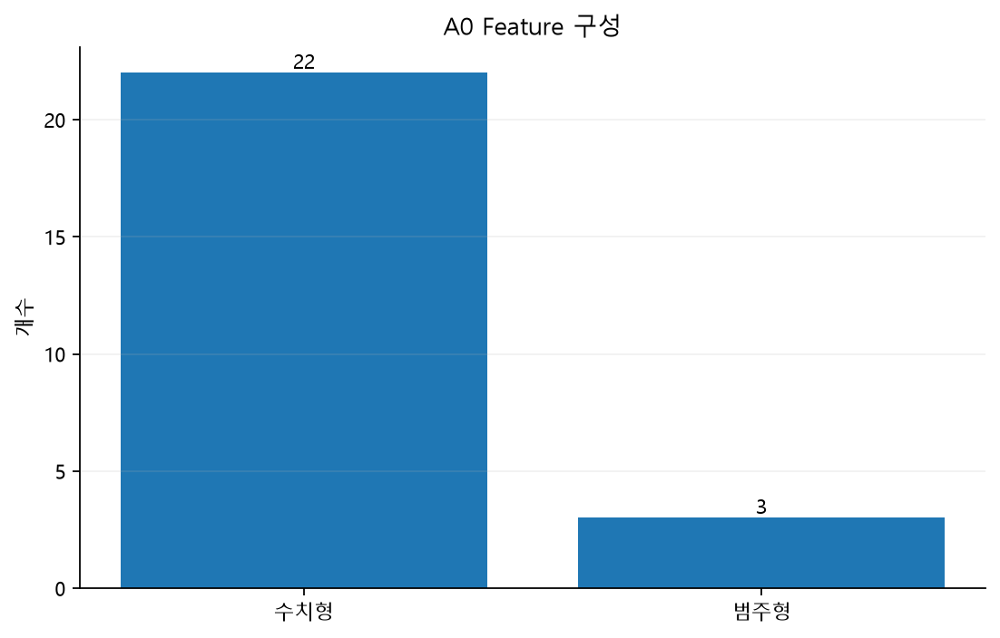

---

## 13. A3 계약 생애주기 Feature Engineering

### 13.1 추가 목적

A0에서는 원본 날짜 컬럼을 모델에 직접 사용하지 않음.

대신 고객이 계약 생애주기의 어느 위치에 있는지 수치와 이진 변수로 표현하기 위해 계약 날짜 기반 Feature를 추가함.

A0에 12개 Feature를 추가한 최종 구성을 A3로 사용함.

```text
A0 25개
+
계약 생애주기 Feature 12개
=
A3 37개
```

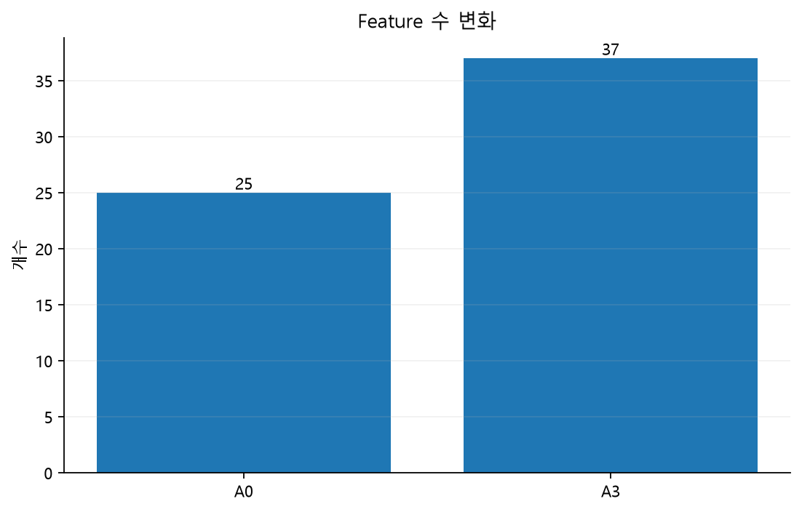

### 13.2 추가 Feature 12개

| Feature | 계산 의미 |
|---|---|
| `contract_tenure_days` | 기준일 - 계약 시작일 |
| `total_contract_days` | 계약 종료일 - 계약 시작일 |
| `days_until_contract_end` | 계약 종료일 - 기준일 |
| `days_until_renewal` | 갱신일 - 기준일 |
| `days_since_product_modification` | 기준일 - 상품 변경일 |
| `renewal_end_gap_days` | 계약 종료일 - 갱신일 |
| `modified_within_3m` | 기준일 직전 3개월 내 상품 변경 여부 |
| `renewal_within_3m` | 기준일 이후 3개월 내 갱신 예정 여부 |
| `contract_age_ratio` | 계약 유지일 / 전체 계약기간 |
| `contract_end_before_reference` | 계약 종료일이 기준일 이전인지 |
| `renewal_before_reference` | 갱신일이 기준일 이전인지 |
| `modification_after_reference` | 상품 변경일이 기준일 이상인지 |

### 13.3 계약 유지 기간과 이탈률

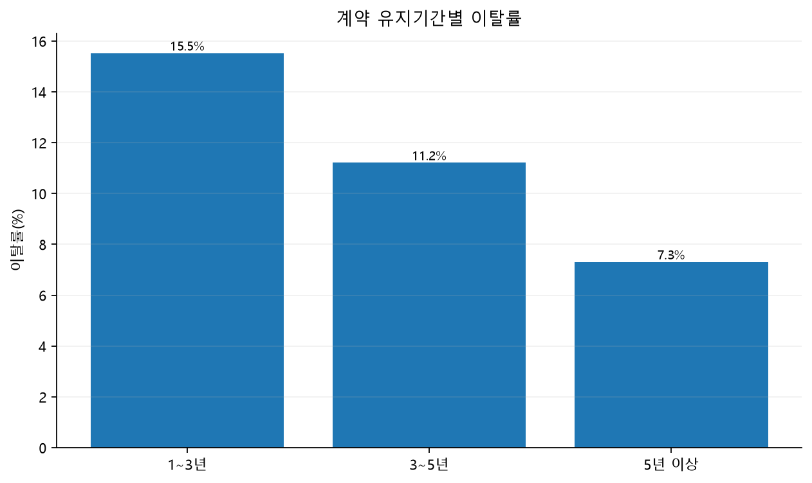

계약 유지기간별 이탈률 차이를 통해 단순한 원본 날짜보다 **고객의 계약 단계 자체를 Feature로 표현할 필요성**을 확인함.

### 13.4 계약 종료까지 남은 기간과 이탈률

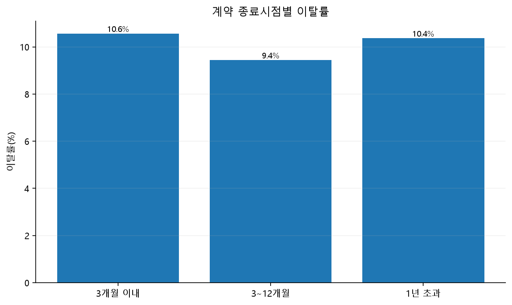

계약 종료 시점까지 남은 기간을 연속형 Feature로 변환해 고객별 계약 시점을 동일한 기준에서 비교할 수 있도록 함.

### 13.5 최근 소비 변화와 이탈률

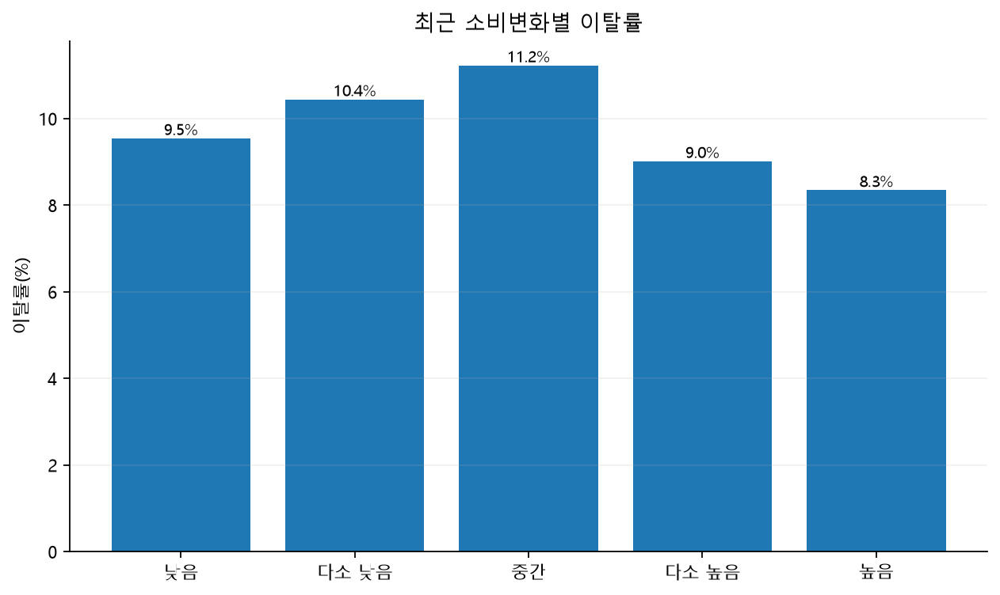

최근 소비 변화는 절대 소비량만으로는 표현하기 어려운 **고객 행동의 변화 방향**을 나타냄.

위 그래프들은 인과관계를 의미하지 않으며 Feature Engineering 과정에서 확인한 탐색적 연관 패턴으로 해석함.

---

## 14. 최종 데이터 저장 구조

전처리 과정은 중간 산출물과 최종 모델 입력을 분리해 저장함.

```text
data/
├── raw/
│   ├── client_data.csv
│   └── price_data.csv
│
├── interim/
│   ├── 01_train_client.csv
│   ├── 01_test_client.csv
│   ├── 01_train_price.csv
│   ├── 01_test_price.csv
│   ├── 02_train_merged.csv
│   ├── 02_test_merged.csv
│   ├── 03_train_plus.csv
│   └── 03_test_plus.csv
│
└── processed/
    ├── train.csv
    └── test.csv
```

### 14.1 단계별 의미

| 파일 | 의미 |
|---|---|
| `01_train/test_client.csv` | 고객 기준 Train/Test 분할 결과 |
| `01_train/test_price.csv` | 분할된 고객에 해당하는 월별 가격 이력 |
| `02_train/test_merged.csv` | 고객 + 가격 집계 + A0 파생변수까지 포함한 중간 결과 |
| `03_train/test_plus.csv` | A3 계약 Feature 12개를 추가한 최종 중간 산출물 |
| `processed/train.csv`, `test.csv` | 모델 코드가 읽는 공식 최종 입력 |

`preprocessing_plus.py` 실행 후에는 동일한 최종 A3 DataFrame을 다음 두 위치에 저장함.

```text
03_train_plus.csv / 03_test_plus.csv
→ 처리 단계 이력 보존

processed/train.csv / processed/test.csv
→ 모델링 코드의 공식 입력
```

### 14.2 최종 데이터 크기

| 항목 | Train | Test |
|---|---:|---:|
| 고객 수 | 11,684 | 2,922 |
| 모델 Feature | 37 | 37 |
| ID | 1 | 1 |
| Target | 1 | 1 |
| 전체 컬럼 | 39 | 39 |

최종 컬럼 순서는 다음 구조를 유지함.

```text
id
→ 37개 모델 Feature
→ churn
```

---

## 15. 모델 입력 전처리 Pipeline

`processed/train.csv`와 `test.csv`는 최종 Feature 구조까지 생성된 데이터임.

그러나 **중앙값 대체, 범주형 인코딩, Scaling처럼 학습 데이터로부터 규칙을 학습하는 변환은 CSV에 미리 적용하지 않음.**

이 단계는 모델 Pipeline에서 수행함.

### 15.1 수치형 Feature

범주형 3개를 제외한 Feature는 수치형으로 처리함.

```text
수치형 Feature
        ↓
Median Imputation
        ↓
Missing Indicator
        ↓
모델 입력
```

Logistic Regression에서는 이후 StandardScaler를 추가함.

### 15.2 범주형 Feature

최종 범주형 Feature는 세 개임.

```text
channel_sales
has_gas
origin_up
```

처리 과정:

```text
결측 발생 시 "MISSING"
        ↓
One-Hot Encoding
        ↓
모델 입력
```

One-Hot Encoder에는 `handle_unknown="ignore"`를 적용함.

따라서 학습 데이터에서 보지 못한 새로운 범주가 Validation/Test 또는 실제 예측 데이터에 나타나도 예측 과정이 중단되지 않음.

### 15.3 Scaling

| 모델 | Scaling |
|---|---|
| Logistic Regression | `StandardScaler` 적용 |
| Random Forest | 미적용 |
| XGBoost | 미적용 |
| LightGBM | 미적용 |

Logistic Regression은 Feature 크기에 영향을 받기 때문에 표준화를 적용함.

Tree 기반 모델은 Feature의 절대 크기보다 분할 기준을 사용하므로 별도의 Scaling을 적용하지 않음.

---

## 16. 데이터 누수 방지 설계

전처리에서 가장 중요하게 관리한 부분은 **Train/Test 및 Cross Validation 간 정보 누수 방지**임.

### 16.1 고객 단위 선분할

가격 데이터 집계 전에 고객을 먼저 Train/Test로 분리함.

따라서 같은 고객의 가격 이력이 서로 다른 Split에 섞이지 않음.

### 16.2 기준일 이후 가격 차단

가격 Feature에는 `price_date < 2016-01-01`인 데이터만 사용함.

예측 시점 이후 가격이 입력에 포함되지 않도록 통제함.

### 16.3 학습 기반 변환의 Pipeline화

잘못된 방식:

```text
전체 Train의 중앙값 계산
→ 전체 Train 결측 대체
→ Cross Validation
```

이 경우 Validation Fold의 분포가 중앙값 계산에 포함됨.

본 프로젝트는 다음 방식으로 처리함.

```text
Cross Validation 분할
        ↓
각 Train Fold에서만
- Median 학습
- MISSING 처리 규칙 적용
- One-Hot Encoder 학습
- StandardScaler 학습(LR)
        ↓
Validation Fold에는 변환만 적용
```

`Pipeline`과 `ColumnTransformer`를 사용해 전처리 자체를 Cross Validation 내부에 포함함.

---

## 17. 데이터 시점과 Leakage 관련 주의사항

계약 날짜 기반 Feature는 **해당 날짜 정보가 예측 기준일 시점에 실제로 알고 있던 정보라는 가정** 아래 사용함.

특히 `date_modif_prod`와 같이 데이터 스냅샷 시점에 따라 사후 업데이트될 가능성이 있는 컬럼은 실제 운영 환경에서 다음을 확인해야 함.

- 해당 값이 `2016-01-01` 당시 이미 저장되어 있던 정보인지
- 결과 발생 이후 갱신된 값이 아닌지
- 실제 배포 시점에도 동일한 방식으로 조회 가능한 정보인지

따라서 `modification_after_reference`를 포함한 날짜 Feature는 **공개 데이터의 생성·갱신 시점이 명확하다는 전제에서 유효**하며, 운영 적용 전 Point-in-Time 정합성 검증이 필요함.

이는 Feature 자체가 이탈의 원인이라는 의미와도 구분해야 함. 날짜·소비·가격 Feature는 예측에 사용되는 연관 신호이며 인과관계를 의미하지 않음.

---

## 18. 최종 품질 검증

A0와 A3 생성 후 다음 조건을 자동 검증함.

### 18.1 구조 검증

- Train/Test 컬럼 구조 동일
- `id`가 첫 식별 컬럼으로 유지
- `churn`이 마지막 Target 컬럼으로 유지
- A3 Feature 12개 존재
- 최종 모델 Feature 37개 확인

### 18.2 고객 정합성 검증

- Train ID 중복 없음
- Test ID 중복 없음
- Train/Test ID 교집합 없음
- A0 → A3 전환 후 고객 수 유지
- A0 → A3 전환 후 고객별 Target 유지

### 18.3 값 검증

- 전체 행 중복 없음
- 수치형 무한대 셀 없음
- 가격 집계 후 고객 ID 1:1 유지
- Feature 병합 후 고객 수 변경 없음
- 로그 Feature 생성 전 음수 소비량 점검

검증에 실패하면 최종 파일을 정상 결과로 간주하지 않고 오류를 발생시키도록 구성함.

---

## 19. 전처리 전·후 비교

| 항목 | 전처리 전 | 전처리 후 |
|---|---|---|
| 분석 단위 | 고객 데이터와 월별 가격 데이터 분리 | 고객 1명당 1행 |
| 월별 가격 | 고객당 여러 행 | 고객 단위 가격 변화 Feature |
| 날짜 | 문자열 원본 날짜 | 기준일 기반 기간·여부 Feature |
| 원본 결측 | 직접 결측 없음 | 원본 값 유지 |
| 계산 불가능 값 | 비율 계산 시 발생 가능 | `NaN`으로 통일 |
| 무한대 | 발생 가능 | 최종 0개 검증 |
| 고객 중복 | 점검 필요 | 고객 ID 유일성 검증 |
| 중복 Feature | 존재 가능 | 중복 검사 및 중복 마진 변수 제거 |
| 이상값 | 큰 소비량·마진·계약전력 가능 | 근거 없이 고객 행 삭제하지 않음 |
| 범주형 | 원본 문자열 | Pipeline에서 MISSING + One-Hot |
| Scaling | 미적용 | Logistic Regression만 StandardScaler |
| 데이터 누수 | 처리 순서에 따라 가능 | 고객 선분할 + 기준일 필터 + Pipeline |
| Feature 수 | 원본 컬럼 중심 | 최종 37개 |
| 고객 수 | 14,606명 | Train 11,684 / Test 2,922, 삭제 없음 |

---

## 20. 전처리 산출물

### 20.1 모델링 데이터

```text
data/interim/
data/processed/
```

중간 처리 결과와 최종 모델 입력을 분리해 보관함.

### 20.2 EDA 및 Streamlit용 Artifact

전처리 실행 시 Streamlit에서 원본 데이터를 다시 집계하지 않도록 필요한 요약 결과를 함께 저장함.

```text
artifacts/eda/
├── dataset_overview.csv
├── churn_distribution.csv
├── raw_tenure_churn_summary.csv
├── raw_margin_churn_summary.csv
├── raw_gas_churn_summary.csv
├── preprocessing_flow.csv
├── a3_overview.csv
├── feature_churn_profile.csv
├── feature_catalog.csv
├── risk_segment_matrix.csv
├── a3_missing_values.csv
├── peer_reference.csv
└── a3_feature_list.csv
```

EDA Artifact는 모델 결과가 아니라 **모델링 전 데이터 구조와 컬럼별 패턴을 설명하기 위한 자료**임.

### 20.3 보고서 이미지

```text
docs/images/preprocessing_report/
├── 01_churn_distribution.png
├── 02a_tenure_years_churn_rate.png
├── 02b_margin_net_churn_rate.png
├── 02c_has_gas_churn_rate.png
├── 03_train_test_churn_rate.png
├── 04_monthly_price_median_trend.png
├── 05_a0_feature_composition.png
├── 06_contract_tenure_churn_rate.png
├── 07_contract_end_churn_rate.png
├── 08_consumption_change_churn_rate.png
└── 09_a0_a3_feature_count.png
```

원본 결측값이 0개이므로 의미 없는 빈 결측률 그래프는 보고서에서 제외함.

---

## 21. 실행 순서 및 재현 방법

프로젝트 루트에서 다음 순서로 실행함.

```bash
python preprocessing/data_preprocessing.py
python preprocessing/preprocessing_plus.py
```

### 1단계: `data_preprocessing.py`

생성:

```text
data/interim/01_*.csv
data/interim/02_*.csv
data/processed/train.csv
data/processed/test.csv
artifacts/eda/ 기본 EDA Artifact
docs/images/preprocessing_report/ 기본 그래프
```

이 시점의 `processed/train.csv`, `test.csv`는 A0 기준 데이터임.

### 2단계: `preprocessing_plus.py`

생성:

```text
data/interim/03_train_plus.csv
data/interim/03_test_plus.csv
data/processed/train.csv
data/processed/test.csv
artifacts/eda/ A3 EDA Artifact
docs/images/preprocessing_report/ A3 관련 그래프
```

두 번째 단계에서 `processed/train.csv`, `test.csv`를 **최종 A3 37개 Feature 버전으로 갱신**함.

따라서 최종 모델 학습 전에는 반드시 두 스크립트를 순서대로 실행해야 함.

---

## 22. 최종 요약

최종 전처리 흐름은 다음과 같음.

```text
원본 고객 데이터 + 월별 가격 데이터
        ↓
스키마·키·중복 검증
        ↓
고객 기준 Train/Test 선분할
        ↓
기준일 이전 가격만 사용
        ↓
월별 가격 → 고객 단위 가격 변화 Feature
        ↓
고객 + 가격 1:1 병합
        ↓
A0 기본 Feature 25개
        ↓
계약 생애주기 A3 Feature 12개 추가
        ↓
최종 37개 Feature
        ↓
processed/train.csv / test.csv
        ↓
모델 Pipeline
├─ Numeric: Median + Missing Indicator
├─ Categorical: MISSING + One-Hot Encoding
└─ Logistic Regression: StandardScaler
```

이번 전처리는 단순한 데이터 정제보다 **고객 단위 정합성, 시간 기준 통제, 데이터 누수 방지, 재현 가능한 모델 입력 구조**를 만드는 데 초점을 맞춤.

원본 데이터에는 직접 결측값이 없어 불필요한 결측 대체나 고객 삭제를 하지 않았으며, 계산 과정에서 발생할 수 있는 예외 값만 안전하게 통제함.

또한 월별 가격 데이터를 고객 단위로 변환하고 계약 생애주기 정보를 추가해 최종 37개 Feature를 구성했으며, 학습 데이터로부터 규칙을 배워야 하는 인코딩·결측 대체·Scaling은 모델 Pipeline 내부에 두어 Cross Validation 과정의 정보 누수를 방지함.
