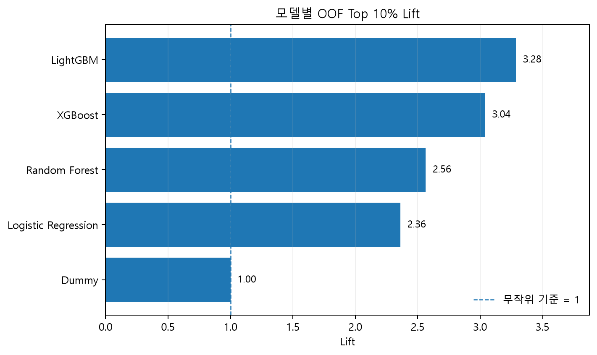
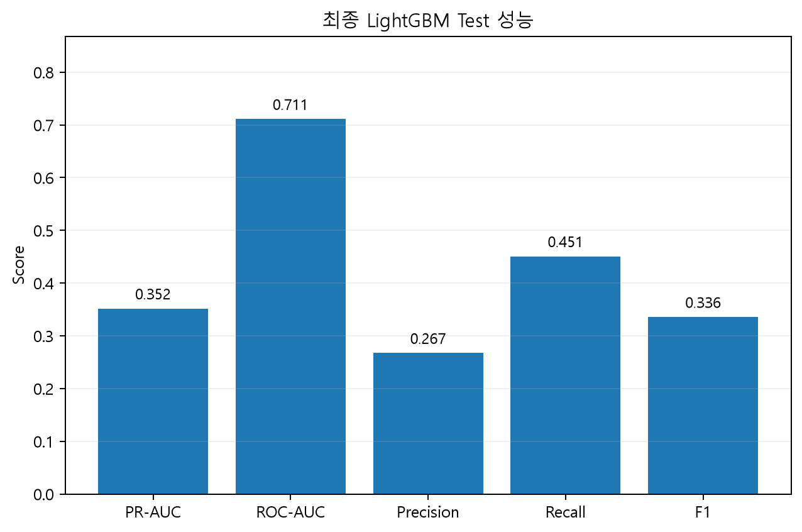
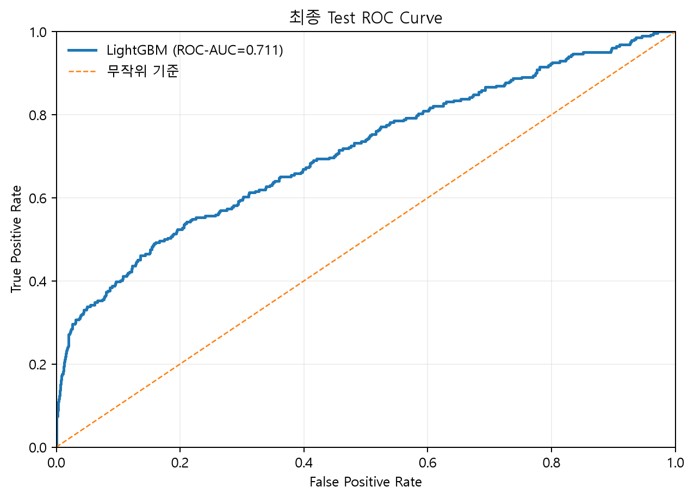
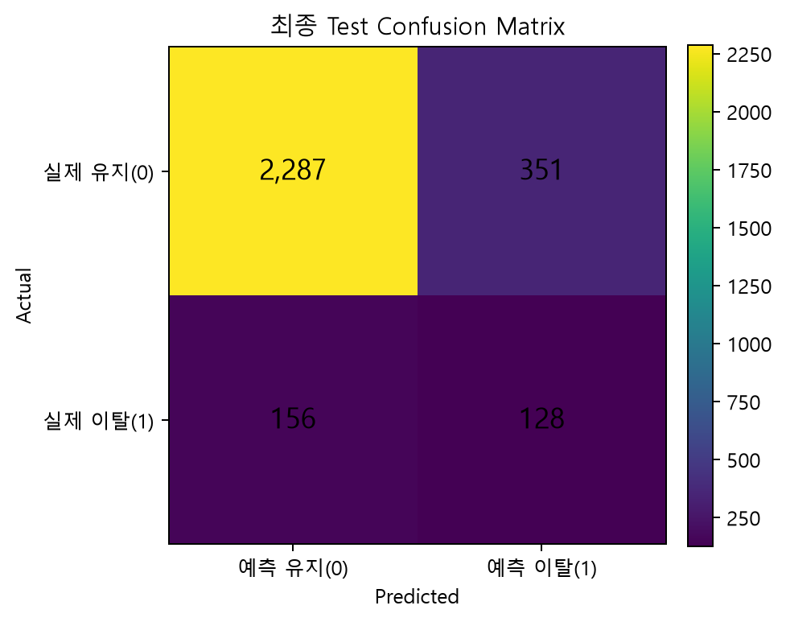
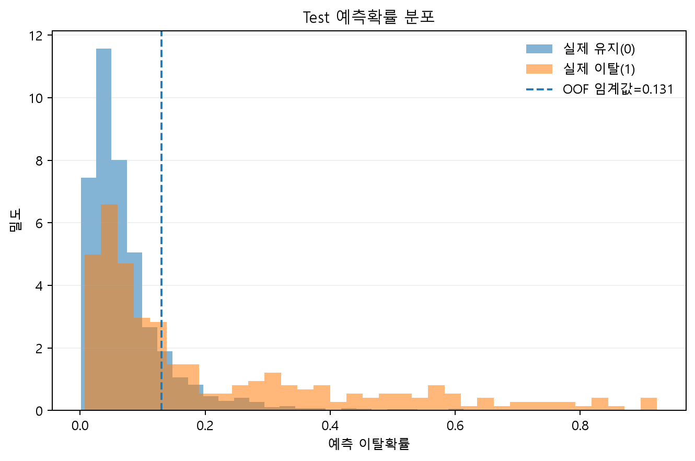

# PowerCo 인공지능 모델 학습 결과서

## 1. 보고서 개요

### 1.1 목적

본 보고서는 **PowerCo 고객 이탈 예측 및 고위험 고객 선별** 프로젝트에서 수행한 인공지능 모델 학습, 검증, 비교, 최종 모델 선정 및 Test 평가 결과를 정리한 문서이다.

본 프로젝트의 모델링 목표는 단순히 고객의 이탈 여부를 0과 1로 분류하는 데 있지 않다.  
전체 고객 중 실제 이탈 고객의 비율이 약 **9.7%**인 불균형 환경에서, 이탈 가능성이 높은 고객을 우선순위화하여 **제한된 리텐션 자원을 고위험 고객에게 집중할 수 있는 예측 모델**을 구축하는 것을 목표로 했다.

모델링 단계에서는 다음 원칙을 적용했다.

1. **Train 데이터에서 모델 선택과 임계값 결정을 완료**
2. **불균형 데이터에 적합한 PR-AUC를 주 평가지표로 사용**
3. **Nested Cross Validation을 통해 튜닝과 성능 평가를 분리**
4. **OOF 예측으로 모델 간 성능을 비교하고 최종 Champion을 선정**
5. **OOF에서 결정한 임계값을 Test에 그대로 고정 적용**
6. **단순 분류 성능뿐 아니라 Top 10% Recall과 Lift를 통해 실제 고객 선별 효율을 평가**

---

## 2. 모델 학습에 사용한 데이터

### 2.1 최종 모델 입력 데이터

전처리 단계에서 생성한 최종 A3 데이터셋을 모델 학습에 사용했다.

| 항목 | Train | Test |
|---|---:|---:|
| 고객 수 | 11,684명 | 2,922명 |
| 모델 Feature | 37개 | 37개 |
| Target | `churn` | `churn` |
| 분석 단위 | 고객 1명당 1행 | 고객 1명당 1행 |

Target은 다음과 같다.

```text
churn = 0  → 유지 고객
churn = 1  → 이탈 고객
```

원본 `client_data.csv`는 26개 컬럼으로 구성되며, `id`와 Target `churn`을 제외하면 원본 모델 후보 Feature는 24개임. 월별 `price_data.csv`의 8개 컬럼은 단순히 추가하지 않고 고객 단위 가격 변화 정보로 집계해 활용함.

최종 37개 Feature는 고객의 계약, 소비, 가격, 마진, 채널 정보와 전처리 단계에서 생성한 가격 변화 및 계약 생애주기 Feature로 구성함.

### 2.2 Train/Test 사용 원칙

전체 고객을 고객 ID 기준으로 먼저 80:20 Stratified Split한 결과를 그대로 사용했다.

```text
전체 고객 14,606명
        ↓
Train 11,684명
Test   2,922명
```

- **Train**: 모델 비교, 하이퍼파라미터 탐색, OOF 예측, 임계값 결정
- **Test**: 최종 Champion 모델의 일반화 성능 확인

모델 선택과 임계값 결정은 Train의 OOF 결과를 기준으로 수행했으며, 최종 선정 이후 Test에 고정 적용했다.

---

## 2.3 최종 Feature Set 선정 배경

최종 모델 비교에 앞서 사용할 Feature Set을 먼저 결정함.

A0 25개 Feature를 기준선으로 두고, 고객 이탈을 설명할 수 있는 정보 방향을 여러 관점에서 독립적으로 비교함.

| 실험 | 검토 방향 |
|---|---|
| A1 | 누수 민감도 |
| A2 | 가격 시계열 정보 |
| A3 | 계약 생애주기 정보 |
| A4 | 소비·마진 비율 및 가격 노출도 |

A1 → A2 → A3를 순차적으로 누적한 구조가 아니라, **A0를 기준으로 각 개선안을 독립적으로 적용해 동일한 Train OOF 조건에서 비교**함.

동일한 무가중치 LightGBM 기준으로 A0 대비 A3의 OOF PR-AUC는 **0.2755 → 0.3176**, Top 10% Lift는 **2.93배 → 3.34배**로 개선됨. LightGBM과 Random Forest 모두에서 A3가 가장 효과적인 Feature Set으로 확인됨.

이에 계약 유지기간, 계약 종료·갱신까지 남은 기간, 상품 변경 시점 등 계약 생애주기 Feature 12개를 포함한 **A3 37개 Feature를 최종 모델 입력으로 확정함**.

중요하게, A3는 최종 Test 결과를 보고 선택한 것이 아니라 **Train OOF 기반 Feature Selection 결과로 먼저 확정**함. 이후 A3 37개를 고정한 상태에서 Logistic Regression, Random Forest, XGBoost, LightGBM을 비교해 최종 모델을 선정함.

---

## 3. 모델 입력 전처리 Pipeline

37개 Feature를 바로 모델에 입력하지 않고 `Pipeline`과 `ColumnTransformer`를 사용해 모델별 전처리를 함께 묶었다.

### 3.1 수치형 Feature

```text
수치형
→ Median Imputation
→ Missing Indicator
→ 모델 입력
```

원본에는 직접적인 결측값이 없지만, 신규 데이터 또는 파생변수 계산 과정에서 발생할 수 있는 예외적 결측에 대비해 안전장치를 유지했다.

### 3.2 범주형 Feature

최종 범주형 Feature는 다음 3개다.

- `channel_sales`
- `has_gas`
- `origin_up`

처리는 다음과 같다.

```text
결측 발생 시 MISSING
→ One-Hot Encoding
→ 모델 입력
```

`handle_unknown="ignore"`를 적용해 학습 시 보지 못한 신규 범주가 들어와도 추론이 중단되지 않도록 했다.

### 3.3 Scaling

| 모델 | StandardScaler |
|---|---|
| Logistic Regression | 적용 |
| Random Forest | 미적용 |
| XGBoost | 미적용 |
| LightGBM | 미적용 |

Logistic Regression은 변수의 크기에 영향을 받기 때문에 Scaling을 적용했고, Tree 기반 모델에는 별도 Scaling을 적용하지 않았다.

이 모든 학습 기반 변환은 Cross Validation의 각 Train Fold 내부에서 학습해 Validation 정보가 전처리 통계량에 섞이지 않도록 했다.

---

## 4. 비교 모델 구성 및 선정 이유

본 프로젝트에서는 성격이 다른 4개의 분류 알고리즘과 1개의 Dummy Baseline을 비교했다.

### 4.1 Dummy Classifier

**역할: 비학습 기준선**

Dummy는 실제 Feature 패턴을 학습하지 않는 기준 모델이다.

이탈률이 약 9.7%인 데이터에서 학습 모델이 실제로 의미 있는 분류력을 확보했는지 확인하기 위해 사용했다.

Dummy의 PR-AUC는 약 **0.097**로 전체 이탈률과 유사한 수준이며, Top 10% Lift는 **1.00**으로 무작위 선별 수준이다.

### 4.2 Logistic Regression

**역할: 해석 가능한 선형 기준 모델**

- 선형적인 관계를 빠르게 확인할 수 있음
- One-Hot Encoding된 범주형 Feature와 함께 사용하기 쉬움
- 복잡한 Tree 모델과 비교할 수 있는 전통적인 분류 기준선 역할

### 4.3 Random Forest

**역할: Bagging 기반 비선형 모델**

- 비선형 관계와 Feature 간 상호작용을 학습 가능
- 여러 Decision Tree를 결합해 단일 Tree보다 안정적인 예측 가능
- Boosting 계열 모델과 다른 학습 방식의 비교군 역할

### 4.4 XGBoost

**역할: Gradient Boosting 기반 고성능 비교 모델**

- 이전 Tree의 오차를 다음 Tree가 순차적으로 보완
- 정형 데이터에서 높은 예측 성능을 기대할 수 있음
- 규제와 다양한 하이퍼파라미터를 통해 복잡도 제어 가능

### 4.5 LightGBM

**역할: 최종 Champion 후보**

- Gradient Boosting 기반 Tree 모델
- 비선형 관계와 변수 간 상호작용 학습에 강함
- 대규모 정형 데이터에서 학습 효율이 높음
- 본 데이터의 계약·소비·가격 변화처럼 복합적인 비선형 신호를 포착하기 위한 후보로 사용

---

## 5. 불균형 데이터와 평가 지표 선정

전체 고객 중 이탈 고객은 약 9.7%에 불과하다.

이러한 데이터에서 Accuracy만 사용하면 대부분의 고객을 유지 고객으로 예측해도 높은 정확도가 나올 수 있다.

따라서 본 프로젝트에서는 **PR-AUC를 모델 선택의 주 지표**로 사용했다.

### 5.1 Primary Metric: PR-AUC

PR-AUC는 Precision과 Recall의 관계를 전체 임계값 구간에서 평가한다.

- **Precision**: 이탈이라고 예측한 고객 중 실제 이탈 고객 비율
- **Recall**: 실제 이탈 고객 중 모델이 찾아낸 비율

양성 클래스가 적은 불균형 데이터에서 고위험 고객을 얼마나 효과적으로 구분하는지를 평가하기에 적합하다.

본 데이터의 무작위 수준 PR-AUC 기준은 이탈률과 유사한 약 **0.097**이다.

### 5.2 Secondary Metrics

| 지표 | 사용 목적 |
|---|---|
| ROC-AUC | 전체적인 클래스 구분 능력 확인 |
| Precision | 이탈 예측 고객의 적중률 |
| Recall | 실제 이탈 고객 포착 비율 |
| F1 | Precision과 Recall의 균형 |
| Confusion Matrix | TP, FP, TN, FN의 실제 개수 확인 |

### 5.3 운영 관점 지표

모든 고객에게 동일한 리텐션 비용을 사용할 수 없기 때문에 순위 기반 지표도 함께 평가했다.

#### Top 10% Recall

예측확률 상위 10% 고객만 관리했을 때 전체 실제 이탈 고객 중 몇 %를 포함하는지를 측정한다.

#### Lift

무작위로 같은 수의 고객을 선택했을 때보다 이탈 고객이 몇 배 더 밀집되어 있는지를 측정한다.

```text
Lift = 선택 그룹의 이탈률 / 전체 이탈률
```

Lift가 3이면 같은 수의 고객을 무작위로 선택하는 것보다 약 3배 높은 밀도로 이탈 고객을 선별했다는 의미다.

---

## 6. 학습 및 검증 전략

### 6.1 Nested Cross Validation

하이퍼파라미터 탐색 과정의 과적합을 줄이고 모델 비교의 공정성을 높이기 위해 Nested Cross Validation을 적용했다.

```text
Train 11,684명
        ↓
Outer 5-Fold
모델 일반화 성능 평가
        ↓
각 Outer Train 내부
Inner 3-Fold RandomizedSearchCV
        ↓
평가지표: average_precision(PR-AUC)
        ↓
각 Outer Validation 예측 저장
        ↓
전체 Train OOF Prediction 생성
```

- Outer Fold: 5
- Inner Fold: 3
- Search: `RandomizedSearchCV`
- Scoring: `average_precision`
- Random State: 42

### 6.2 OOF Prediction

OOF(Out-of-Fold) 예측은 각 고객이 자신의 학습에 사용되지 않은 Fold의 모델로 예측된 결과다.

이를 통해 Train 전체에 대해 과도하게 낙관적인 In-Sample 예측이 아니라 보다 현실적인 성능 비교가 가능하다.

최종 Champion 모델은 **OOF PR-AUC가 가장 높은 모델**을 기준으로 선정했다.

---

## 7. 모델 비교 결과


### 7.1 OOF 성능 비교

| 모델 | OOF PR-AUC | OOF ROC-AUC | Precision | Recall | F1 | Top 10% Lift |
|---|---:|---:|---:|---:|---:|---:|
| Dummy | 0.0971 | 0.5000 | 0.0971 | 1.0000 | 0.1771 | 1.0000 |
| Logistic Regression | 0.1788 | 0.6545 | 0.1932 | 0.3930 | 0.2590 | 2.3600 |
| Random Forest | 0.2367 | 0.6800 | 0.2020 | 0.4361 | 0.2761 | 2.5626 |
| XGBoost | 0.2717 | 0.6959 | 0.2879 | 0.3216 | 0.3038 | 3.0381 |
| **LightGBM** | **0.3172** | **0.6927** | **0.3257** | **0.3269** | **0.3263** | **3.2847** |

LightGBM은 주 평가지표인 **OOF PR-AUC 0.317**로 가장 높은 성능을 기록했다.

XGBoost의 OOF ROC-AUC는 0.696로 LightGBM보다 소폭 높았지만, 본 프로젝트는 불균형 데이터에서 실제 이탈 고객을 선별하는 능력을 우선했기 때문에 **PR-AUC를 기준으로 LightGBM을 Champion으로 선정**했다.

### 7.2 Top 10% Lift 비교



LightGBM의 OOF Top 10% Lift는 **3.28배**였다.

이는 Train OOF 기준으로 예측확률 상위 10% 고객군에 이탈 고객이 무작위 추출보다 약 3.28배 높은 밀도로 포함되었다는 의미다.

또한 상위 10% 고객만 선택했을 때 전체 실제 이탈자의 약 **32.9%**를 포함했다.

따라서 단순 분류 성능뿐 아니라 실제 리텐션 대상 우선순위화에서도 LightGBM이 가장 높은 활용 가능성을 보였다.

---

## 8. 최종 Champion 모델 선정

최종 Champion은 **LightGBM**이다.

선정 근거는 다음과 같다.

1. OOF PR-AUC **0.317**로 후보 모델 중 1위
2. Dummy PR-AUC 약 0.097 대비 약 **3.27배** 수준의 PR-AUC
3. OOF Top 10% Lift **3.28배**
4. 상위 10% 고객만으로 전체 이탈자의 약 **32.9%** 포착
5. Precision과 Recall의 균형을 나타내는 OOF F1도 후보군 중 가장 높은 수준

즉 LightGBM은 전체적인 이탈확률 순위화와 실제 고위험 고객 집중 선별 측면에서 가장 적합한 모델이었다.

---

## 9. 임계값 결정

이진 분류의 기본 임계값 0.5를 그대로 사용하지 않았다.

본 데이터는 이탈률이 약 9.7%인 불균형 데이터이며, 0.5는 비즈니스 목적이나 클래스 분포를 반영한 값이 아니다.

따라서 Champion LightGBM의 **OOF Prediction에서 F1이 최대가 되는 임계값**을 선택했다.

```text
OOF F1 최적 임계값
= 0.130526
≈ 0.131
```

이 임계값에서 OOF 성능은 다음과 같다.

| 지표 | OOF 결과 |
|---|---:|
| Precision | 0.3257 |
| Recall | 0.3269 |
| F1 | 0.3263 |

중요한 점은 Test 성능을 보고 임계값을 다시 조정하지 않고, **OOF에서 정한 약 0.131을 최종 Test에 그대로 적용**했다는 것이다.

---

## 10. 최종 Test 평가

최종 LightGBM Pipeline을 전체 Train 데이터에 다시 학습한 뒤, OOF에서 결정한 임계값 **0.130526**을 Test에 고정 적용했다.

Test 데이터는 총 **2,922명**이며 실제 이탈 고객은 **284명**, 유지 고객은 **2,638명**이다.

### 10.1 Test 주요 성능



| 지표 | Test 결과 |
|---|---:|
| PR-AUC | **0.351573** |
| ROC-AUC | **0.710978** |
| Precision | **0.267223** |
| Recall | **0.450704** |
| F1 | **0.335518** |
| 적용 임계값 | **0.130526** |

최종 Test에서 PR-AUC는 **0.352**, ROC-AUC는 **0.711**을 기록했다.

OOF에서 결정한 임계값을 적용했을 때:

- Precision: 약 **26.7%**
- Recall: 약 **45.1%**
- F1: 약 **0.336**

이었다.

즉 실제 이탈 고객 284명 중 약 **45.1%**를 이탈 위험 고객으로 포착했다.

---

## 11. Precision-Recall Curve


PR Curve는 여러 임계값에서 Precision과 Recall의 Trade-off를 보여준다.

Test PR-AUC는 **0.352**이며, 무작위 수준의 기준선인 전체 이탈률 약 **0.097**보다 명확하게 높은 값을 보였다.

이는 모델이 실제 이탈 고객을 확률 순위상 상위에 배치하는 능력이 있음을 의미한다.

---

## 12. ROC Curve



Test ROC-AUC는 **0.711**이다.

ROC-AUC는 임의의 이탈 고객과 유지 고객을 한 명씩 선택했을 때 모델이 이탈 고객에게 더 높은 위험 점수를 부여할 가능성을 전반적으로 나타낸다.

다만 본 프로젝트에서는 양성 클래스가 적기 때문에 모델 선정 자체는 ROC-AUC보다 PR-AUC를 우선했다.

---

## 13. Confusion Matrix



OOF에서 결정한 임계값 0.131을 적용한 Test Confusion Matrix는 다음과 같다.

| 구분 | 고객 수 |
|---|---:|
| True Negative | 2,287 |
| False Positive | 351 |
| False Negative | 156 |
| True Positive | 128 |

전체 Test 고객 2,922명 중 모델이 이탈 위험 고객으로 분류한 고객은 **479명**, 약 **16.4%**다.

실제 이탈 고객 284명 중:

- **128명**을 포착
- **156명**은 놓침

으로 나타났다.

이 결과는 모든 실제 이탈 고객을 찾는 모델이라기보다, 일정 수준의 Precision을 유지하면서 관리 대상 고객을 좁히는 운영적 활용에 적합하다는 것을 보여준다.

---

## 14. 예측확률 분포



실제 유지 고객과 이탈 고객의 예측확률 분포는 완전히 분리되지는 않는다.

이는 고객 이탈이 계약·소비·가격 정보만으로 완벽히 결정되는 문제가 아니라는 것을 의미한다.

다만 실제 이탈 고객이 상대적으로 더 높은 예측확률 영역에 많이 위치하며, 이러한 확률 순위를 활용해 고위험 고객부터 관리하는 전략이 가능하다.

따라서 모델의 예측확률은 절대적인 이탈 확정값보다는 **리스크 우선순위 점수**로 해석하는 것이 적절하다.

---

## 15. Top-K 고객 선별 성능


최종 모델의 가장 중요한 비즈니스 활용 결과 중 하나는 상위 위험 고객 선별 성능이다.

### 15.1 Test Top 10% 결과

Test 고객 2,922명 중 예측확률 상위 10%는 **293명**이다.

이 그룹에 실제 이탈 고객은 **100명** 포함되어 있다.

| 지표 | Test Top 10% |
|---|---:|
| 관리 고객 수 | 293명 |
| 포함된 실제 이탈 고객 | 100명 |
| Precision | 34.1% |
| 전체 이탈자 Recall | 35.2% |
| Lift | 3.51배 |

즉 전체 고객의 약 10%만 관리해도 전체 실제 이탈 고객 284명 중 **100명, 약 35.2%**를 포함할 수 있었다.

또한 이 그룹의 이탈 고객 밀도는 무작위로 같은 수의 고객을 선택했을 때보다 약 **3.51배** 높았다.

이 결과는 모델의 가장 직접적인 운영적 의미를 보여준다.

```text
전체 고객 2,922명
        ↓
예측확률 상위 약 10%
293명 우선 관리
        ↓
실제 이탈 고객 100명 포함
        ↓
전체 이탈자의 35.2% 포착
Lift 3.51배
```

따라서 유지관리 예산이 제한되어 있을 경우 모든 고객에게 동일하게 캠페인을 집행하는 것보다 모델의 위험 순위를 활용해 상위 고객부터 관리하는 것이 더 효율적이다.

---

## 16. 최종 모델링 흐름

전체 모델링 과정은 다음과 같다.

```text
최종 A3 데이터
Train 11,684 / Test 2,922
37 Features
        ↓
모델별 Pipeline 구성
        ↓
Dummy Baseline
Logistic Regression
Random Forest
XGBoost
LightGBM
        ↓
Nested CV
Outer 5-Fold / Inner 3-Fold
RandomizedSearchCV
Scoring = PR-AUC
        ↓
Train OOF Prediction 생성
        ↓
OOF PR-AUC 비교
        ↓
LightGBM Champion 선정
OOF PR-AUC = 0.317
        ↓
OOF에서 F1 최적 임계값 결정
Threshold = 0.131
        ↓
전체 Train으로 최종 LightGBM 재학습
        ↓
Test에 임계값 고정 적용
        ↓
PR-AUC = 0.352
ROC-AUC = 0.711
F1 = 0.336
Recall = 45.1%
        ↓
Top 10% 고객 선별
전체 이탈자의 35.2% 포착
Lift = 3.51배
```

---

## 17. 최종 결과 해석

최종 LightGBM은 모든 고객의 이탈 여부를 완벽하게 판정하는 모델은 아니다.

그러나 본 프로젝트의 목적은 모든 이탈 고객을 100% 맞히는 것이 아니라 **실제 이탈 가능성이 높은 고객을 우선순위화하는 것**이다.

최종 결과를 종합하면:

1. 불균형 데이터에서 주 지표인 Test PR-AUC **0.352**
2. 실제 이탈 고객의 **45.1%**를 임계값 기준으로 포착
3. 전체 고객의 상위 10%만 선별해도 전체 이탈자의 **35.2%** 포함
4. Top 10% 이탈 밀도는 무작위 대비 **3.51배**
5. 위험확률을 이용해 고객별 우선 관리 순위를 제공할 수 있음

따라서 LightGBM 모델은 이탈 여부를 절대적으로 확정하는 용도보다, **제한된 리텐션 자원을 고위험 고객에게 우선 배분하기 위한 고객 우선순위 모델**로 활용하는 것이 가장 적절하다.

---

## 18. 모델 저장 및 추론 활용

최종 모델은 전처리 Pipeline과 분류기를 함께 저장해 학습 시 사용한 전처리와 추론 시 전처리가 동일하게 적용되도록 구성했다.

프로젝트의 주요 모델 파일은 다음과 같다.

```text
models/
├── logistic_regression_pipeline.joblib
├── random_forest_pipeline.joblib
├── xgboost_pipeline.joblib
├── lightgbm_pipeline.joblib
├── champion_bundle.joblib
└── champion_metadata.json
```

최종 Champion Bundle에는 다음 정보를 함께 관리한다.

- 최종 Pipeline
- Feature 목록 및 순서
- OOF 기준 최종 임계값
- 고위험 상위 10% 기준
- Target 및 ID 정보
- 범주형 컬럼 정보

이를 통해 Streamlit 및 `src/predict.py`에서 동일한 모델과 Feature Schema를 사용해 고객별 이탈 위험도를 예측할 수 있도록 했다.

---

## 19. 모델의 활용 범위와 한계

### 19.1 활용 범위

본 모델은 다음과 같이 활용할 수 있다.

- 고객별 이탈 위험확률 산출
- 고위험 고객 순위화
- 리텐션 캠페인 대상 우선 선정
- 관리 가능한 고객 수에 따른 Top-K 전략 수립
- 고객별 위험 신호 확인

### 19.2 한계

현재 데이터는 계약·소비·가격 정보가 중심이다.

다음과 같은 정보는 포함되지 않았다.

- 고객 만족도
- 상담 및 민원 이력
- 서비스 장애 경험
- 경쟁사 가격 및 프로모션
- 실제 캠페인 반응 여부
- 고객별 유지 비용과 생애가치

따라서 예측확률 또는 Feature 기여도가 이탈의 직접적인 **원인**을 의미하지는 않는다.

또한 실제 운영에서는 시간이 지나면서 고객 행동과 시장 가격 구조가 달라질 수 있으므로 데이터 드리프트와 모델 성능을 지속적으로 점검해야 한다.

---

## 20. 최종 요약

본 프로젝트는 최종 A3 37개 Feature를 사용해 Dummy, Logistic Regression, Random Forest, XGBoost, LightGBM을 비교했다.

모델 선택은 이탈률 약 9.7%의 불균형 문제를 고려해 **OOF PR-AUC**를 주 지표로 수행했으며, Nested 5-Fold / Inner 3-Fold Cross Validation과 RandomizedSearchCV를 사용했다.

최종적으로 **LightGBM**이 OOF PR-AUC **0.317**로 가장 높은 성능을 기록해 Champion으로 선정되었다.

OOF에서 F1이 최대가 되는 임계값 **0.131**을 결정한 뒤 이를 Test에 고정 적용한 결과:

```text
Test PR-AUC     0.352
Test ROC-AUC    0.711
Precision       0.267
Recall          0.451
F1              0.336
```

을 기록했다.

특히 예측확률 상위 10%인 293명만 우선 관리했을 때 실제 이탈 고객 100명이 포함되었고, 전체 이탈자의 **35.2%**를 포착했다.

이 그룹의 이탈 밀도는 무작위 선정 대비 **3.51배** 높았다.

따라서 최종 LightGBM 모델은 단순 이탈 판정기가 아니라, **이탈 가능성이 높은 고객을 선별하고 제한된 리텐션 자원을 효율적으로 배분하기 위한 위험 우선순위 모델**로 활용할 수 있다.
